# Vector RAG Quantization

**Revolutionizing Data Management**

The AI and ML field demands efficient high-dimensional data handling. Vector databases are vital for Retrieval-Augmented Generation (RAG), recommendation systems, and more. These applications excel in swift similarity searches across vast embedding vector datasets.

## Importance

In the rapidly evolving landscape of artificial intelligence and machine learning, efficient management and retrieval of high-dimensional data have become paramount. Vector databases play a crucial role in enabling applications such as **Retrieval-Augmented Generation (RAG)**, **recommendation systems**, **semantic search engines**, and **personalized content delivery**. These applications rely on the ability to perform swift and accurate similarity searches across vast datasets of embedding vectors.

### **Justification of Storage Efficiency Calculations**

Quantization methods significantly enhance storage efficiency. Calculations show reduced bits per component vs. Float32, ensuring optimal data management.

---

#### **1. Understanding Bit Depths**

- **Float32:**
  - **Bit Depth:** 32 bits per embedding component.
  - **Usage:** Standard representation offering high precision.

- **Int4:**
  - **Bit Depth:** 4 bits per embedding component.
  - **Usage:** Low-precision quantization suitable for extreme memory constraints.

- **Int8:**
  - **Bit Depth:** 8 bits per embedding component.
  - **Usage:** Medium-precision quantization balancing memory efficiency and accuracy.

- **Int16:**
  - **Bit Depth:** 16 bits per embedding component.
  - **Usage:** High-precision quantization ensuring minimal accuracy loss.

---

### **Storage Reduction Calculations**

The storage reduction for each quantization method is calculated based on the number of bits used per embedding component compared to the standard **Float32** representation (32 bits per component). Below are the detailed calculations for different quantization methods, considering embeddings are per token:

Summary of Storage Savings from Vector RAG Quantization
Quantizing vector embeddings for a document of 410 tokens significantly reduces storage requirements:

Int4 Quantization achieves about 87.30% savings, offering substantial compression but with a slight overhead for metadata per token.

Int4Global Quantization leads with roughly 87.50% savings, maximizing efficiency by using a single scaling factor across all tokens, though potentially at the expense of some precision.

Int8 Quantization provides approximately 74.74% reduction in storage, balancing between compression and maintaining more data precision through per-token scaling.
Int8Global Quantization saves around 75.00%, slightly more efficient than Int8 due to not needing per-token metadata, yet still maintains a reasonable level of precision.

Int16 Quantization reduces storage by about 49.48%, ensuring high precision with individual scaling for each token, suitable for applications where data accuracy is critical.

Int16Global Quantization offers exactly 50.00% savings, providing a mid-point between storage efficiency and precision with a uniform scaling approach.

These savings percentages illustrate the trade-offs between storage efficiency, computational resources, and precision, aiding in deciding which quantization method to employ based on specific application needs.
---

#### **Int4 Quantization**

- **Original Size per Token**:
  - For an embedding dimension of `1024`:
    - Size of float32 embedding = $1024 \times 4 \text{ bytes} = 4096 \text{ bytes}$ per token.

- **Quantized Size with Nibble Packing per Token**:
  - Each 4-bit value (nibble) is packed two per byte:
    - Size of int4 packed embedding = $\frac{1024}{2} = 512 \text{ bytes}$ per token.

- **Additional Metadata per Token**:
  - Each token stores `min_val` and `max_val` for scaling back, each taking 4 bytes:
    - Additional metadata size = $2 \times 4 \text{ bytes} = 8 \text{ bytes}$.

- **Total Storage per Token after Quantization**:
  - Int4 packed data: 512 bytes
  - Metadata: 8 bytes
  - Total = $512 + 8 = 520 \text{ bytes}$ per token.

- **Sieve in Numbers for Document with 410 Tokens**:
  - Total float32 size for document: $4096 \text{ bytes/token} \times 410 \text{ tokens} = 1679360 \text{ bytes}$.
  - Total int4 size for document: $520 \text{ bytes/token} \times 410 \text{ tokens} = 213200 \text{ bytes}$.
  - Sieve = $1679360 \text{ bytes (float32)} - 213200 \text{ bytes (int4 + metadata)} = 1466160 \text{ bytes saved per document}$.

Therefore, the storage saved by using 4-bit quantization with nibble packing for a document with 410 tokens is **1,466,160 bytes**.

---

#### **Int4Global Quantization**

- **Original Size per Token**:
  - For an embedding dimension of `1024`:
    - Size of float32 embedding = $1024 \times 4 \text{ bytes} = 4096 \text{ bytes}$ per token.

- **Quantized Size with Nibble Packing per Token**:
  - Each 4-bit value (nibble) is packed two per byte:
    - Size of int4 packed embedding = $\frac{1024}{2} = 512 \text{ bytes}$ per token.

- **Additional Metadata per Token**:
  - No per-token `min_val` and `max_val` are stored since we use a single `global_limit` for all tokens:
    - Additional metadata size = $0 \text{ bytes}$ per token (global limit is in config).

- **Total Storage per Token after Quantization**:
  - Int4 packed data: 512 bytes
  - Metadata: 0 bytes (since global limit applies to all)
  - Total = $512 \text{ bytes}$ per token.

- **Sieve in Numbers for Document with 410 Tokens**:
  - Total float32 size for document: $4096 \text{ bytes/token} \times 410 \text{ tokens} = 1679360 \text{ bytes}$.
  - Total int4Global size for document: $512 \text{ bytes/token} \times 410 \text{ tokens} = 209920 \text{ bytes}$.
  - Sieve = $1679360 \text{ bytes (float32)} - 209920 \text{ bytes (int4)} = 1469440 \text{ bytes saved per document}$.

Therefore, the storage saved by using 4-bit quantization with a global limit for a document with 410 tokens is **1,469,440 bytes**.

---

### **Comparison**

- **Int4 Quantization vs. Int4Global Quantization:**
  - **Storage Efficiency:** 
    - **Int4:** Saves **1,466,160 bytes** with additional metadata for precision.
    - **Int4Global:** Saves **1,469,440 bytes** with no per-token metadata, maximizing storage efficiency but at a potential loss of precision.
  - **Precision:**
    - **Int4:** Offers better precision through token-specific scaling.
    - **Int4Global:** Uses a uniform scale, which might not be ideal for all tokens, possibly leading to precision loss.
  - **Use Case:**
    - **Int4:** Suited for applications where individual token precision is critical.
    - **Int4Global:** Ideal for scenarios where uniform scaling is acceptable, and storage is a priority.

---

#### **Int8 Quantization (VectorDBInt8)**

- **Original Size per Token**:
  - For an embedding dimension of `1024`:
    - Size of float32 embedding = $1024 \times 4 \text{ bytes} = 4096 \text{ bytes}$ per token.

- **Quantized Size per Token**:
  - Each 8-bit value is stored individually:
    - Size of int8 packed embedding = $1024 \times 1 \text{ byte} = 1024 \text{ bytes}$ per token.

- **Additional Metadata per Token**:
  - Each token stores `min_val` and `max_val` for scaling, each taking 4 bytes:
    - Additional metadata size = $2 \times 4 \text{ bytes} = 8 \text{ bytes}$.

- **Total Storage per Token after Quantization**:
  - Int8 data: 1024 bytes
  - Metadata: 8 bytes
  - Total = $1024 + 8 = 1032 \text{ bytes}$ per token.

- **Sieve in Numbers for Document with 410 Tokens**:
  - Total float32 size for document: $4096 \text{ bytes/token} \times 410 \text{ tokens} = 1679360 \text{ bytes}$.
  - Total int8 size for document: $1032 \text{ bytes/token} \times 410 \text{ tokens} = 424240 \text{ bytes}$.
  - Sieve = $1679360 \text{ bytes (float32)} - 424240 \text{ bytes (int8 + metadata)} = 1255120 \text{ bytes saved per document}$.

Therefore, the storage saved by using 8-bit quantization with per-token scaling for a document with 410 tokens is **1,255,120 bytes**.

---

#### **Int8Global Quantization (VectorDBInt8Global)**

- **Original Size per Token**:
  - For an embedding dimension of `1024`:
    - Size of float32 embedding = $1024 \times 4 \text{ bytes} = 4096 \text{ bytes}$ per token.

- **Quantized Size per Token**:
  - Each 8-bit value is stored individually:
    - Size of int8 packed embedding = $1024 \times 1 \text{ byte} = 1024 \text{ bytes}$ per token.

- **Additional Metadata per Token**:
  - No per-token `min_val` and `max_val` are stored since we use a single `global_limit` for all tokens:
    - Additional metadata size = $0 \text{ bytes}$ per token (global limit is in config).

- **Total Storage per Token after Quantization**:
  - Int8 data: 1024 bytes
  - Metadata: 0 bytes (since global limit applies to all)
  - Total = $1024 \text{ bytes}$ per token.

- **Sieve in Numbers for Document with 410 Tokens**:
  - Total float32 size for document: $4096 \text{ bytes/token} \times 410 \text{ tokens} = 1679360 \text{ bytes}$.
  - Total int8Global size for document: $1024 \text{ bytes/token} \times 410 \text{ tokens} = 419840 \text{ bytes}$.
  - Sieve = $1679360 \text{ bytes (float32)} - 419840 \text{ bytes (int8)} = 1259520 \text{ bytes saved per document}$.

Therefore, the storage saved by using 8-bit quantization with a global limit for a document with 410 tokens is **1,259,520 bytes**.

### **Comparison**

- **Int8 Quantization vs. Int8Global Quantization:**
  - **Storage Efficiency:** 
    - **Int8:** Saves **1,255,120 bytes** with per-token scaling for better precision.
    - **Int8Global:** Saves **1,259,520 bytes** without per-token metadata, offering slightly more storage efficiency.
  - **Precision:**
    - **Int8:** Maintains token-specific scaling, preserving accuracy for varied datasets.
    - **Int8Global:** Applies a uniform global limit, potentially sacrificing precision for consistency.
  - **Use Case:**
    - **Int8:** Recommended when maintaining high precision across diverse datasets is vital.
    - **Int8Global:** Useful when storage savings are prioritized over individual token precision.

---

#### **Int16 Quantization (VectorDBInt16)**

- **Original Size per Token**:
  - For an embedding dimension of `1024`:
    - Size of float32 embedding = $1024 \times 4 \text{ bytes} = 4096 \text{ bytes}$ per token.

- **Quantized Size per Token**:
  - Each 16-bit value is stored individually:
    - Size of int16 packed embedding = $1024 \times 2 \text{ bytes} = 2048 \text{ bytes}$ per token.

- **Additional Metadata per Token**:
  - Each token stores `min_val` and `max_val` for scaling, each taking 4 bytes:
    - Additional metadata size = $2 \times 4 \text{ bytes} = 8 \text{ bytes}$.

- **Total Storage per Token after Quantization**:
  - Int16 data: 2048 bytes
  - Metadata: 8 bytes
  - Total = $2048 + 8 = 2056 \text{ bytes}$ per token.

- **Sieve in Numbers for Document with 410 Tokens**:
  - Total float32 size for document: $4096 \text{ bytes/token} \times 410 \text{ tokens} = 1679360 \text{ bytes}$.
  - Total int16 size for document: $2056 \text{ bytes/token} \times 410 \text{ tokens} = 848480 \text{ bytes}$.
  - Sieve = $1679360 \text{ bytes (float32)} - 848480 \text{ bytes (int16 + metadata)} = 830880 \text{ bytes saved per document}$.

Therefore, the storage saved by using 16-bit quantization with per-token scaling for a document with 410 tokens is **830,880 bytes**.

---

#### **Int16Global Quantization (VectorDBInt16Global)**

- **Original Size per Token**:
  - For an embedding dimension of `1024`:
    - Size of float32 embedding = $1024 \times 4 \text{ bytes} = 4096 \text{ bytes}$ per token.

- **Quantized Size per Token**:
  - Each 16-bit value is stored individually:
    - Size of int16 packed embedding = $1024 \times 2 \text{ bytes} = 2048 \text{ bytes}$ per token.

- **Additional Metadata per Token**:
  - No per-token `min_val` and `max_val` are stored since we use a single `global_limit` for all tokens:
    - Additional metadata size = $0 \text{ bytes}$ per token (global limit is in config).

- **Total Storage per Token after Quantization**:
  - Int16 data: 2048 bytes
  - Metadata: 0 bytes (since global limit applies to all)
  - Total = $2048 \text{ bytes}$ per token.

- **Sieve in Numbers for Document with 410 Tokens**:
  - Total float32 size for document: $4096 \text{ bytes/token} \times 410 \text{ tokens} = 1679360 \text{ bytes}$.
  - Total int16Global size for document: $2048 \text{ bytes/token} \times 410 \text{ tokens} = 839680 \text{ bytes}$.
  - Sieve = $1679360 \text{ bytes (float32)} - 839680 \text{ bytes (int16)} = 839680 \text{ bytes saved per document}$.

Therefore, the storage saved by using 16-bit quantization with a global limit for a document with 410 tokens is **839,680 bytes**.

### **Comparison**

- **Int16 Quantization vs. Int16Global Quantization:**
  - **Storage Efficiency:** 
    - **Int16:** Saves **830,880 bytes** with token-specific scaling for high precision.
    - **Int16Global:** Saves **839,680 bytes** by eliminating per-token metadata, offering maximum storage efficiency at the cost of uniform scaling.
  - **Precision:**
    - **Int16:** Provides high precision with individual scaling, suitable for applications where accuracy is paramount.
    - **Int16Global:** Applies a global scaling, which might not accommodate all data distributions, potentially affecting precision.
  - **Use Case:**
    - **Int16:** Choose for scenarios where precision is critical, and data diversity is significant.
    - **Int16Global:** Opt for when storage efficiency is the top priority, and the dataset has relatively uniform characteristics.

---

### **4. Implications of Storage Reduction**

- **Memory Footprint:**
  - **Int4:** Reduces memory usage by **87.5%**, enabling the handling of significantly larger datasets within the same memory constraints.
  - **Int8:** Decreases memory usage by **75%**, providing a substantial balance between compression and computational efficiency.
  - **Int16:** Lowers memory usage by **50%**, maintaining a moderate level of compression while preserving higher precision.

- **Disk Space Savings:**
  - The reduction percentages directly translate to decreased storage requirements on disk, allowing for more cost-effective storage solutions and faster data retrieval times.

---

### **Conclusion**

The storage efficiency gains from quantization are crucial for optimizing vector databases, especially when dealing with high-dimensional embeddings and large-scale datasets. By understanding and applying these quantization methods:

- **Int4 Quantization** offers the highest storage savings (**87.5%**) but at the cost of reduced precision, making it suitable for applications where memory is a critical constraint and slight accuracy loss is acceptable.
  
- **Int8 Quantization** strikes a balance with a **75%** storage reduction and minimal precision loss, ideal for most real-world applications that require both efficiency and accuracy.
  
- **Int16 Quantization** provides a **50%** reduction in storage while maintaining near-lossless precision, making it the preferred choice for applications where high accuracy is paramount.

These calculated storage reductions empower developers and organizations to make informed decisions based on their specific resource constraints and precision requirements, ultimately enhancing the performance and scalability of AI-driven applications.

### Efficient Resource Utilization

As the volume of data scales, so does the dimensionality of embeddings, leading to significant **memory and storage demands**. Traditional **Float32** representations, while precise, are **memory-intensive** and **computationally expensive**, posing challenges for large-scale deployments. **Quantization** techniques, which reduce the bit-depth of embeddings (e.g., to **Int4**, **Int8**, or **Int16**), offer a solution by **compressing data** and **reducing memory footprint**, thereby enabling more **cost-effective** and **scalable** systems.

### Balancing Precision and Performance

Quantization inherently involves a trade-off between **precision** and **performance**. **Local quantization** ensures high precision by tailoring the scaling factor to each document's unique embedding distribution, making it ideal for applications where **accuracy is critical**. Conversely, **global quantization** applies a uniform scaling factor across all embeddings, simplifying the process and enhancing **computational efficiency**, which is beneficial for **real-time** and **large-scale** applications where **speed** is a priority.

### Enhancing Scalability and Speed

By implementing quantization strategies, vector databases can achieve **faster indexing and retrieval times**, essential for applications requiring **low-latency** responses. This improvement is particularly significant in scenarios involving **millions of documents**, where efficient similarity search directly impacts the **user experience** and **system responsiveness**.

### Practical Implications for Deployment

Understanding the **trade-offs** between local and global quantization methods empowers developers and organizations to make informed decisions based on their specific use cases. For instance, **global quantization** may be preferred in environments where **uniform data distributions** exist and **memory constraints** are stringent, while **local quantization** is better suited for **diverse datasets** requiring **high precision**.

### Driving Innovation in AI Applications

The ability to efficiently store and retrieve high-dimensional embeddings accelerates the development of **advanced AI models** and **intelligent systems**. By optimizing vector databases through quantization, researchers and engineers can push the boundaries of what is possible in areas like **natural language processing**, **computer vision**, and **personalized medicine**, fostering **innovation** and **enhanced capabilities** in AI-driven applications.

---

By systematically evaluating and implementing both local and global quantization strategies, the **Vector RAG Quantization** project addresses critical challenges in managing high-dimensional data. This enables the creation of **robust**, **scalable**, and **efficient** vector databases that underpin the next generation of intelligent applications.

## Table of Contents

- [Overview](#overview)
- [Analysis Report: Int4, Int8, and Int16 Quantization Methods](#analysis-report-int4-int8-and-int16-quantization-methods)
  - [Summary](#summary)
  - [Observations](#observations)
    - [1. Int4 Quantization](#1-int4-quantization)
    - [2. Int8 Quantization](#2-int8-quantization)
    - [3. Int16 Quantization](#3-int16-quantization)
  - [Key Takeaways](#key-takeaways)
  - [Recommendations](#recommendations)
  - [Results Summary Table](#results-summary-table)
  - [Conclusion](#conclusion)
  - [Analysis of `VectorDBInt16Global.py` vs `VectorDBInt16.py`](#analysis-of-vectordbint16globalpy-vs-vectordbint16py)
  - [Analysis of `VectorDBInt8Global.py` vs `VectorDBInt8.py`](#analysis-of-vectordbint8globalpy-vs-vectordbint8py)
  - [Analysis of `VectorDBInt4Global.py` vs `VectorDBInt4.py`](#analysis-of-vectordbint4globalpy-vs-vectordbint4py)
- [Quantization in Vector Databases](#quantization-in-vector-databases)
- [Execution Context](#execution-context)
- [Visualizations](#visualizations)
  - [Local Quantization (`VectorDBInt16`)](#local-quantization-vectordbint16)
  - [Global Quantization (`VectorDBInt16Global`)](#global-quantization-vectordbint16global)
- [Setup & Running](#setup--running)
  - [Dependencies](#dependencies)
  - [Running the Analysis](#running-the-analysis)
- [Recommendations](#recommendations-1)

---

## Overview

This repository contains implementations and analyses of two quantization methods for vector databases:

- **Local Quantization** (`VectorDBInt16`): Quantizes each document's embeddings independently.
- **Global Quantization** (`VectorDBInt16Global`): Applies a single quantization limit to all embeddings.

---

# Analysis Report: Int4, Int8, and Int16 Quantization Methods

## Summary

This report evaluates the performance of various quantization methods (**Int4**, **Int8**, **Int16**) applied to a FAISS index with an embedding dimension of 1024. The analysis includes both local and global workflows, comparing the quantized methods against the baseline **Float32** results for the query: *"Artificial intelligence is transforming industries."*

---

## Observations

### 1. **Int4 Quantization**
- **Average Percentage Difference (Local):** 0.4411%
- **Median Percentage Difference (Local):** 0.3560%
- **Average Percentage Difference (Global):** 0.5474%
- **Median Percentage Difference (Global):** 0.5474%
- **Maximum Percentage Difference:** 2.1938% (Local), 0.6051% (Global)
- **Document ID Mismatches:** Several mismatches between Float32 and Int4 document IDs.
  
**Notes:** 
- Minor deviations in scores compared to Float32.
- Document mismatches indicate potential indexing alignment issues.
- Global Int4 demonstrated slightly better stability than Local Int4.

### 2. **Int8 Quantization**
- **Average Percentage Difference (Local):** 1.2454%
- **Median Percentage Difference (Local):** 1.2127%
- **Average Percentage Difference (Global):** 0.0483%
- **Median Percentage Difference (Global):** 0.0244%
- **Maximum Percentage Difference:** 1.4241% (Local), 0.1664% (Global)
- **Minimum Percentage Difference:** 1.1170% (Local), 0.0005% (Global)
  
**Notes:** 
- Global Int8 showed near-perfect alignment with Float32, with minimal differences.
- Local Int8 introduced slightly higher deviations but remained within acceptable thresholds for most applications.

### 3. **Int16 Quantization**
- **Average Percentage Difference (Local):** 0.0048%
- **Median Percentage Difference (Local):** 0.0047%
- **Average Percentage Difference (Global):** 0.0011%
- **Median Percentage Difference (Global):** 0.0011%
- **Maximum Percentage Difference:** 0.0055% (Local), 0.0021% (Global)
- **Minimum Percentage Difference:** 0.0044% (Local), 0.0002% (Global)
  
**Notes:** 
- Both Local and Global Int16 quantization exhibited exceptional accuracy, nearly mirroring the Float32 results.
- Deviations are negligible, making Int16 the most reliable quantization method in this analysis.

---

## Key Takeaways

1. **Accuracy Trends:**
   - **Int4:** Suitable for scenarios with tight memory constraints but involves minor trade-offs in accuracy and potential document mismatches.
   - **Int8:** Provides a good balance between memory savings and accuracy, especially with the global workflow.
   - **Int16:** Delivers near-lossless accuracy while still offering compression benefits.

2. **Document ID Mismatches:**
   - Discrepancies in document IDs suggest possible alignment or indexing issues in the quantized workflows. Further debugging is recommended to ensure consistency.

3. **Performance Stability:**
   - Global workflows consistently outperformed local workflows in terms of accuracy and score alignment with Float32.

---

## Recommendations

1. **Use Case Fit:**
   - **Int4:** Best for extreme memory-constrained environments where slight accuracy loss is acceptable.
   - **Int8:** Ideal for most applications requiring a balance of memory efficiency and high accuracy.
   - **Int16:** Optimal for scenarios prioritizing accuracy with moderate memory savings.

2. **Alignment Issues:**
   - Investigate document ID mismatches between Float32 and quantized results to improve consistency and reliability.

3. **Global Workflow Preference:**
   - Favor global workflows over local ones for better accuracy and reduced deviation percentages.

---

## Results Summary Table

| **Quantization Method** | **Workflow Type** | **Avg. Diff (%)** | **Median Diff (%)** | **Max Diff (%)** | **Min Diff (%)** |
|-------------------------|--------------------|--------------------|----------------------|-------------------|-------------------|
| **Int4**                | Local              | 0.4411             | 0.3560               | 2.1938            | 0.0849            |
|                         | Global             | 0.5474             | 0.5474               | 0.6051            | 0.4896            |
| **Int8**                | Local              | 1.2454             | 1.2127               | 1.4241            | 1.1170            |
|                         | Global             | 0.0483             | 0.0244               | 0.1664            | 0.0005            |
| **Int16**               | Local              | 0.0048             | 0.0047               | 0.0055            | 0.0044            |
|                         | Global             | 0.0011             | 0.0011               | 0.0021            | 0.0002            |

---

## Conclusion

- **Int16 Global Workflow:** Recommended for applications demanding the highest accuracy.
- **Int8 Global Workflow:** Offers an excellent balance of performance and efficiency.
- **Int4 Local Workflow:** Feasible for extreme memory-limited cases but requires improvement in document alignment.

Results are saved in `results.csv` for detailed inspection.

---

# Analysis of `VectorDBInt16Global.py` vs `VectorDBInt16.py`

## Core Differences

### Quantization Approach

- **`VectorDBInt16Global.py`** employs a **global quantization** strategy, clipping all embeddings to a single global limit (±1.0 by default). This approach utilizes a uniform scaling factor across all documents, simplifying data management but potentially sacrificing precision for documents with outliers.

- **`VectorDBInt16.py`** utilizes **local quantization**, scaling each document's embedding based on its own min and max values. This method preserves the distribution of each document's data, offering higher precision for individual documents but requiring additional metadata (min and max values) for each embedding.

### Storage and Overhead

- **Global Quantization:**
  - **Low Overhead:** Does **not** store per-document scaling data, minimizing storage requirements.
  - **Limitation:** May struggle with documents that have diverse value ranges.

- **Local Quantization:**
  - **High Overhead:** **Increases storage** due to the need to save min and max values for each document.
  - **Advantage:** Ensures better handling of document-specific variance, especially in large datasets.

### Performance and Precision

- **Global Quantization:**
  - **Consistent Performance:** Uniform quantization rules lead to predictable and stable performance across all documents.
  - **Precision Trade-off:** May compromise precision for documents with extreme values outside the global clipping range.

- **Local Quantization:**
  - **High Precision:** Maintains precision by preserving each document's embedding distribution, effectively handling outliers.
  - **Variable Performance:** Introduces higher computational overhead due to document-specific scaling and dequantization processes.

## Algorithm Descriptions

### Local Quantization (`VectorDBInt16`)

- **Method:** Each document's embedding is quantized independently, scaling based on its own min and max values. This retains the original distribution but requires storing `min_max` values for dequantization.

  **Pros:**
  - High precision for documents with unique value distributions.
  - Better handling of outliers within individual documents.

  **Cons:**
  - Higher storage requirements due to additional metadata.
  - Increased computational overhead for scaling and dequantization during searches.

### Global Quantization (`VectorDBInt16Global`)

- **Method:** Uses a single global clipping limit for all embeddings, applying uniform scaling across documents. This simplifies data management but might not handle outliers as effectively for all documents.

  **Pros:**
  - Lower storage overhead since no per-document scaling data is needed.
  - Simplified quantization process leads to consistent performance.

  **Cons:**
  - Potential loss of precision for documents with values outside the common range.

## Implementation Details

### Embedding Generation

Both classes generate embeddings via an external API, but their quantization strategies differ:
- **`VectorDBInt16Global`** applies a global clip and scale.
- **`VectorDBInt16`** applies document-specific scaling.

### Search Mechanism

Both implementations employ a two-phase search process:
1. **Phase 1:** An approximate search using binary embeddings for efficiency.
2. **Phase 2:** A refinement phase using either Float32 or quantized embeddings. The choice affects the balance between speed and accuracy:
   - **`VectorDBInt16Global`** uses a single scale for dequantization, which might not capture document-specific nuances.
   - **`VectorDBInt16`** dequantizes back to Float32 using document-specific scales, potentially offering more accurate results at the cost of additional computational steps.

### Database Management

Both utilize **FAISS** for indexing and **RocksDB** for document storage, ensuring disk-based operations for scalability. However, the local quantization in **`VectorDBInt16`** requires additional management of per-document metadata.

## Disk Databases

Both implementations leverage disk-based storage using:

- **FAISS:** For efficient similarity search on disk.
- **RocksDB** (via `Rdict`): For persistent document storage.

**Advantages of Disk Databases over In-Memory (Float32):**

1. **Memory Efficiency:** Quantized embeddings (Int16) significantly reduce memory usage compared to Float32.
2. **Disk Space Savings:** Int16 quantization halves the storage requirement per embedding vector.
3. **Faster Index Loading:** Enables quicker restarts and scaling across sessions.
4. **Scalability:** Handles datasets too large to fit in RAM.
5. **Precision vs. Performance:** Balances negligible precision loss with storage and speed efficiency.

## Use Cases

### Local Quantization (`VectorDBInt16`)

- **Specialized Content:** Ideal for content with varied embedding value ranges.
- **High Precision Requirement:** Critical for applications needing precise similarity scores, e.g., medical diagnostics or personalized recommendations.
- **Small to Medium Datasets:** Where storage isn't a concern, and precision is prioritized.

### Global Quantization (`VectorDBInt16Global`)

- **Generalized Content:** Best for datasets with uniform content, like general news or broad forums.
- **Large Scale Applications:** Ideal for millions of documents where memory efficiency is key.
- **Real-Time Systems:** Prioritizes speed and uniform performance.

## Conclusion

Choosing between `VectorDBInt16Global` and `VectorDBInt16` depends on the trade-off between precision, storage, and performance:

- **`VectorDBInt16Global`** is suited for scenarios where simplicity and scalability are key, making it ideal for large-scale, uniform datasets where memory and computational efficiency are prioritized over precision for individual documents.
  
- **`VectorDBInt16`** is ideal when individual document precision is critical, such as in specialized content areas (e.g., medical, technical documents). It ensures better handling of document-specific variance at the cost of increased storage and computational overhead.

---

# Comparison Table: `VectorDBInt16Global.py` vs `VectorDBInt16.py`

| **Feature**                     | **`VectorDBInt16Global.py`**                                                                 | **`VectorDBInt16.py`**                                                                                     |
|---------------------------------|----------------------------------------------------------------------------------------------|-------------------------------------------------------------------------------------------------------------|
| **Quantization Approach**       | **Global Quantization**<br>All embeddings are clipped to a single global limit (±1.0 by default). Uses a uniform scaling factor across all documents. | **Local Quantization**<br>Embeddings are scaled based on each document's own min and max values. Retains individual distributions. |
| **Storage and Overhead**        | **Low Overhead**<br>Does **not** store per-document scaling data, minimizing storage requirements. | **High Overhead**<br>Requires storing min and max values for each document, significantly increasing storage for large datasets. |
| **Performance**                 | **Consistent Performance**<br>Uniform quantization ensures predictable and stable performance across all documents. | **Variable Performance**<br>Higher computational overhead due to document-specific scaling and dequantization processes. |
| **Precision**                   | **Potential Precision Loss**<br>May lose precision for documents with outliers outside the global clipping range. | **High Precision**<br>Maintains precision by preserving each document's embedding distribution, effectively handling outliers. |
| **Pros**                        | - Lower storage requirements<br>- Simplified data management<br>- Consistent and efficient performance | - Higher precision for individual documents<br>- Better handling of outliers<br>- Preserves original embedding distributions |
| **Cons**                        | - May compromise precision for documents with extreme values<br>- Less flexible in handling diverse data ranges | - Increased storage due to additional metadata<br>- More computationally intensive during searches |
| **Embedding Generation**        | Applies a global clip and scale uniformly to all embeddings.                               | Applies document-specific scaling based on each document's min and max values.                              |
| **Search Mechanism**            | - **Phase 1:** Approximate search using binary embeddings<br>- **Phase 2:** Refinement using a single global scale for dequantization | - **Phase 1:** Approximate search using binary embeddings<br>- **Phase 2:** Refinement using document-specific scales for dequantization |
| **Database Management**         | Utilizes **FAISS** for indexing and **RocksDB** for document storage without additional metadata management. | Utilizes **FAISS** for indexing and **RocksDB** for document storage, with added complexity for managing per-document metadata. |
| **Use Case Suitability**        | - Large-scale, uniform datasets<br>- Real-time systems<br>- Generalized content like news or forums | - Specialized content areas (e.g., medical, technical documents)<br>- Applications requiring high precision in similarity searches<br>- Small to medium datasets where storage is less of a concern |
| **Advantages of Disk Databases**| - Memory efficiency with Int16<br>- Disk space savings<br>- Faster index loading<br>- Scalability<br>- Balanced precision and performance | - Memory efficiency with Int16<br>- Disk space savings<br>- Faster index loading<br>- Scalability<br>- Balanced precision and performance |
| **Implementation Complexity**   | **Lower Complexity**<br>Uniform scaling simplifies implementation and maintenance. | **Higher Complexity**<br>Managing per-document scaling factors adds to implementation and maintenance efforts. |

---

**Conclusion:**  
Choose **`VectorDBInt16Global.py`** for scenarios prioritizing simplicity, scalability, and memory efficiency in large-scale or uniform datasets. Opt for **`VectorDBInt16.py`** when individual document precision is critical, such as in specialized content domains, despite the increased storage and computational overhead.

---

---

# Analysis of `VectorDBInt8Global.py` vs `VectorDBInt8.py`

## Core Differences

### Quantization Approach

- **`VectorDBInt8Global.py`** employs a **global quantization** strategy, clipping all embeddings to a single global limit (±0.3 by default). This approach utilizes a uniform scaling factor across all documents, simplifying data management but potentially sacrificing precision for documents with outliers.

- **`VectorDBInt8.py`** utilizes **local quantization**, scaling each document's embedding based on its own min and max values. This method preserves the distribution of each document's data, offering higher precision for individual documents but requiring additional metadata (min and max values) for each embedding.

### Storage and Overhead

- **Global Quantization:**
  - **Low Overhead:** Does **not** store per-document scaling data, minimizing storage requirements.
  - **Limitation:** May struggle with documents that have diverse value ranges.

- **Local Quantization:**
  - **High Overhead:** **Increases storage** due to the need to save min and max values for each document.
  - **Advantage:** Ensures better handling of document-specific variance, especially in large datasets.

### Performance and Precision

- **Global Quantization:**
  - **Consistent Performance:** Uniform quantization rules lead to predictable and stable performance across all documents.
  - **Precision Trade-off:** May compromise precision for documents with extreme values outside the global clipping range.

- **Local Quantization:**
  - **High Precision:** Maintains precision by preserving each document's embedding distribution, effectively handling outliers.
  - **Variable Performance:** Introduces higher computational overhead due to document-specific scaling and dequantization processes.

---

## Algorithm Descriptions

### Local Quantization (`VectorDBInt8`)

- **Method:** Each document's embedding is quantized independently, scaling based on its own min and max values. This retains the original distribution but requires storing `min_max` values for dequantization.
  
  **Pros:**
  - High precision for documents with unique value distributions.
  - Better handling of outliers within individual documents.

  **Cons:**
  - Higher storage requirements due to additional metadata.
  - Increased computational overhead for scaling and dequantization during searches.

### Global Quantization (`VectorDBInt8Global`)

- **Method:** Uses a single global clipping limit for all embeddings, applying uniform scaling across documents. This simplifies data management but might not handle outliers as effectively for all documents.
  
  **Pros:**
  - Lower storage overhead since no per-document scaling data is needed.
  - Simplified quantization process leads to consistent performance.

  **Cons:**
  - Potential loss of precision for documents with values outside the common range.

---

## Implementation Details

### Embedding Generation

Both classes generate embeddings via an external API, but their quantization strategies differ:
- **`VectorDBInt8Global`** applies a global clip and scale.
- **`VectorDBInt8`** applies document-specific scaling based on each document's min and max values.

### Search Mechanism

Both implementations employ a two-phase search process:
1. **Phase 1:** An approximate search using binary embeddings for efficiency.
2. **Phase 2:** A refinement phase using either Float32 or quantized embeddings. The choice affects the balance between speed and accuracy:
   - **`VectorDBInt8Global`** uses a single scale for dequantization, which might not capture document-specific nuances.
   - **`VectorDBInt8`** dequantizes back to Float32 using document-specific scales, potentially offering more accurate results at the cost of additional computational steps.

### Database Management

Both utilize **FAISS** for indexing and **RocksDB** for document storage, ensuring disk-based operations for scalability. However, the local quantization in **`VectorDBInt8`** requires additional management of per-document metadata.

---

---

# Analysis of `VectorDBInt4Global.py` vs `VectorDBInt4.py`

## Core Differences

### Quantization Approach

- **`VectorDBInt4Global.py`** employs a **global quantization** strategy, clipping all embeddings to a single global limit (±0.18 by default). This approach utilizes a uniform scaling factor across all documents, simplifying data management but potentially sacrificing precision for documents with outliers.

- **`VectorDBInt4.py`** utilizes **local quantization**, scaling each document's embedding based on its own min and max values. This method preserves the distribution of each document's data, offering higher precision for individual documents but requiring additional metadata (min and max values) for each embedding.

### Storage and Overhead

- **Global Quantization:**
  - **Low Overhead:** Does **not** store per-document scaling data, minimizing storage requirements.
  - **Limitation:** May struggle with documents that have diverse value ranges.

- **Local Quantization:**
  - **High Overhead:** **Increases storage** due to the need to save min and max values for each document.
  - **Advantage:** Ensures better handling of document-specific variance, especially in large datasets.

### Performance and Precision

- **Global Quantization:**
  - **Consistent Performance:** Uniform quantization rules lead to predictable and stable performance across all documents.
  - **Precision Trade-off:** May compromise precision for documents with extreme values outside the global clipping range.

- **Local Quantization:**
  - **High Precision:** Maintains precision by preserving each document's embedding distribution, effectively handling outliers.
  - **Variable Performance:** Introduces higher computational overhead due to document-specific scaling and dequantization processes.

---

## Algorithm Descriptions

### Local Quantization (`VectorDBInt4`)

- **Method:** Each document's embedding is quantized independently, scaling based on its own min and max values. This retains the original distribution but requires storing `min_max` values for dequantization.
  
  **Pros:**
  - High precision for documents with unique value distributions.
  - Better handling of outliers within individual documents.

  **Cons:**
  - Higher storage requirements due to additional metadata.
  - Increased computational overhead for scaling and dequantization during searches.

### Global Quantization (`VectorDBInt4Global`)

- **Method:** Uses a single global clipping limit for all embeddings, applying uniform scaling across documents. This simplifies data management but might not handle outliers as effectively for all documents.
  
  **Pros:**
  - Lower storage overhead since no per-document scaling data is needed.
  - Simplified quantization process leads to consistent performance.

  **Cons:**
  - Potential loss of precision for documents with values outside the common range.

---

## Implementation Details

### Embedding Generation

Both classes generate embeddings via an external API, but their quantization strategies differ:
- **`VectorDBInt4Global`** applies a global clip and scale.
- **`VectorDBInt4`** applies document-specific scaling based on each document's min and max values.

### Search Mechanism

Both implementations employ a two-phase search process:
1. **Phase 1:** An approximate search using binary embeddings for efficiency.
2. **Phase 2:** A refinement phase using either Float32 or quantized embeddings. The choice affects the balance between speed and accuracy:
   - **`VectorDBInt4Global`** uses a single scale for dequantization, which might not capture document-specific nuances.
   - **`VectorDBInt4`** dequantizes back to Float32 using document-specific scales, potentially offering more accurate results at the cost of additional computational steps.

### Database Management

Both utilize **FAISS** for indexing and **RocksDB** for document storage, ensuring disk-based operations for scalability. However, the local quantization in **`VectorDBInt4`** requires additional management of per-document metadata.

---

## Disk Databases

Both implementations leverage disk-based storage using:

- **FAISS:** For efficient similarity search on disk.
- **RocksDB** (via `Rdict`): For persistent document storage.

**Advantages of Disk Databases over In-Memory (Float32):**

1. **Memory Efficiency:** Quantized embeddings (Int4) significantly reduce memory usage compared to Float32.
2. **Disk Space Savings:** Int4 quantization reduces the storage requirement per embedding vector by 75%.
3. **Faster Index Loading:** Enables quicker restarts and scaling across sessions.
4. **Scalability:** Handles datasets too large to fit in RAM.
5. **Precision vs. Performance:** Balances manageable precision loss with storage and speed efficiency.

---

## Use Cases

### Local Quantization (`VectorDBInt4`)

- **Specialized Content:** Ideal for content with varied embedding value ranges.
- **High Precision Requirement:** Critical for applications needing precise similarity scores, e.g., medical diagnostics or personalized recommendations.
- **Small to Medium Datasets:** Where storage isn't a concern, and precision is prioritized.

### Global Quantization (`VectorDBInt4Global`)

- **Generalized Content:** Best for datasets with uniform content, like general news or broad forums.
- **Large Scale Applications:** Ideal for millions of documents where memory efficiency is key.
- **Real-Time Systems:** Prioritizes speed and uniform performance.

---

# Comparison Table: `VectorDBInt4Global.py` vs `VectorDBInt4.py`, `VectorDBInt8Global.py` vs `VectorDBInt8.py`, and `VectorDBInt16Global.py` vs `VectorDBInt16.py`

| **Feature**                     | **`VectorDBInt4Global.py`**                                                                 | **`VectorDBInt4.py`**                                                                                     | **`VectorDBInt8Global.py`**                                                               | **`VectorDBInt8.py`**                                                                                     | **`VectorDBInt16Global.py`**                                                               | **`VectorDBInt16.py`**                                                                                     |
|---------------------------------|----------------------------------------------------------------------------------------------|-------------------------------------------------------------------------------------------------------------|-------------------------------------------------------------------------------------------|-------------------------------------------------------------------------------------------------------------|-------------------------------------------------------------------------------------------|-------------------------------------------------------------------------------------------------------------|
| **Quantization Approach**       | **Global Quantization**<br>All embeddings are clipped to a single global limit (±0.18 by default). Uses a uniform scaling factor across all documents. | **Local Quantization**<br>Embeddings are scaled based on each document's own min and max values. Retains individual distributions. | **Global Quantization**<br>All embeddings are clipped to a single global limit (±0.3 by default). Uses a uniform scaling factor across all documents. | **Local Quantization**<br>Embeddings are scaled based on each document's own min and max values. Retains individual distributions. | **Global Quantization**<br>All embeddings are clipped to a single global limit (±1.0 by default). Uses a uniform scaling factor across all documents. | **Local Quantization**<br>Embeddings are scaled based on each document's own min and max values. Retains individual distributions. |
| **Storage and Overhead**        | **Low Overhead**<br>Does **not** store per-document scaling data, minimizing storage requirements. | **High Overhead**<br>Requires storing min and max values for each document, significantly increasing storage for large datasets. | **Low Overhead**<br>Does **not** store per-document scaling data, minimizing storage requirements. | **High Overhead**<br>Requires storing min and max values for each document, significantly increasing storage for large datasets. | **Low Overhead**<br>Does **not** store per-document scaling data, minimizing storage requirements. | **High Overhead**<br>Requires storing min and max values for each document, significantly increasing storage for large datasets. |
| **Performance**                 | **Consistent Performance**<br>Uniform quantization ensures predictable and stable performance across all documents. | **Variable Performance**<br>Higher computational overhead due to document-specific scaling and dequantization processes. | **Consistent Performance**<br>Uniform quantization ensures predictable and stable performance across all documents. | **Variable Performance**<br>Higher computational overhead due to document-specific scaling and dequantization processes. | **Consistent Performance**<br>Uniform quantization ensures predictable and stable performance across all documents. | **Variable Performance**<br>Higher computational overhead due to document-specific scaling and dequantization processes. |
| **Precision**                   | **Potential Precision Loss**<br>May lose precision for documents with outliers outside the global clipping range. | **High Precision**<br>Maintains precision by preserving each document's embedding distribution, effectively handling outliers. | **Potential Precision Loss**<br>May lose precision for documents with outliers outside the global clipping range. | **High Precision**<br>Maintains precision by preserving each document's embedding distribution, effectively handling outliers. | **Potential Precision Loss**<br>May lose precision for documents with outliers outside the global clipping range. | **High Precision**<br>Maintains precision by preserving each document's embedding distribution, effectively handling outliers. |
| **Pros**                        | - Lower storage requirements<br>- Simplified data management<br>- Consistent and efficient performance | - Higher precision for individual documents<br>- Better handling of outliers<br>- Preserves original embedding distributions | - Lower storage requirements<br>- Simplified data management<br>- Consistent and efficient performance | - Higher precision for individual documents<br>- Better handling of outliers<br>- Preserves original embedding distributions | - Lower storage requirements<br>- Simplified data management<br>- Consistent and efficient performance | - Higher precision for individual documents<br>- Better handling of outliers<br>- Preserves original embedding distributions |
| **Cons**                        | - May compromise precision for documents with extreme values<br>- Less flexible in handling diverse data ranges | - Increased storage due to additional metadata<br>- More computationally intensive during searches | - May compromise precision for documents with extreme values<br>- Less flexible in handling diverse data ranges | - Increased storage due to additional metadata<br>- More computationally intensive during searches | - May compromise precision for documents with extreme values<br>- Less flexible in handling diverse data ranges | - Increased storage due to additional metadata<br>- More computationally intensive during searches |
| **Embedding Generation**        | Applies a global clip and scale uniformly to all embeddings.                               | Applies document-specific scaling based on each document's min and max values.                              | Applies a global clip and scale uniformly to all embeddings.                               | Applies document-specific scaling based on each document's min and max values.                              | Applies a global clip and scale uniformly to all embeddings.                               | Applies document-specific scaling based on each document's min and max values.                              |
| **Search Mechanism**            | - **Phase 1:** Approximate search using binary embeddings<br>- **Phase 2:** Refinement using a single global scale for dequantization | - **Phase 1:** Approximate search using binary embeddings<br>- **Phase 2:** Refinement using document-specific scales for dequantization | - **Phase 1:** Approximate search using binary embeddings<br>- **Phase 2:** Refinement using a single global scale for dequantization | - **Phase 1:** Approximate search using binary embeddings<br>- **Phase 2:** Refinement using document-specific scales for dequantization | - **Phase 1:** Approximate search using binary embeddings<br>- **Phase 2:** Refinement using a single global scale for dequantization | - **Phase 1:** Approximate search using binary embeddings<br>- **Phase 2:** Refinement using document-specific scales for dequantization |
| **Database Management**         | Utilizes **FAISS** for indexing and **RocksDB** for document storage without additional metadata management. | Utilizes **FAISS** for indexing and **RocksDB** for document storage, with added complexity for managing per-document metadata. | Utilizes **FAISS** for indexing and **RocksDB** for document storage without additional metadata management. | Utilizes **FAISS** for indexing and **RocksDB** for document storage, with added complexity for managing per-document metadata. | Utilizes **FAISS** for indexing and **RocksDB** for document storage without additional metadata management. | Utilizes **FAISS** for indexing and **RocksDB** for document storage, with added complexity for managing per-document metadata. |
| **Use Case Suitability**        | - Large-scale, uniform datasets<br>- Real-time systems<br>- Generalized content like news or forums | - Specialized content areas (e.g., medical, technical documents)<br>- Applications requiring high precision in similarity searches<br>- Small to medium datasets where storage is less of a concern | - Large-scale, uniform datasets<br>- Real-time systems<br>- Generalized content like news or forums | - Specialized content areas (e.g., medical, technical documents)<br>- Applications requiring high precision in similarity searches<br>- Small to medium datasets where storage is less of a concern | - Large-scale, uniform datasets<br>- Real-time systems<br>- Generalized content like news or forums | - Specialized content areas (e.g., medical, technical documents)<br>- Applications requiring high precision in similarity searches<br>- Small to medium datasets where storage is less of a concern |
| **Advantages of Disk Databases**| - Memory efficiency with Int4<br>- Disk space savings<br>- Faster index loading<br>- Scalability<br>- Balanced precision and performance | - Memory efficiency with Int4<br>- Disk space savings<br>- Faster index loading<br>- Scalability<br>- Balanced precision and performance | - Memory efficiency with Int8<br>- Disk space savings<br>- Faster index loading<br>- Scalability<br>- Balanced precision and performance | - Memory efficiency with Int8<br>- Disk space savings<br>- Faster index loading<br>- Scalability<br>- Balanced precision and performance | - Memory efficiency with Int16<br>- Disk space savings<br>- Faster index loading<br>- Scalability<br>- Balanced precision and performance | - Memory efficiency with Int16<br>- Disk space savings<br>- Faster index loading<br>- Scalability<br>- Balanced precision and performance |
| **Implementation Complexity**   | **Lower Complexity**<br>Uniform scaling simplifies implementation and maintenance. | **Higher Complexity**<br>Managing per-document scaling factors adds to implementation and maintenance efforts. | **Lower Complexity**<br>Uniform scaling simplifies implementation and maintenance. | **Higher Complexity**<br>Managing per-document scaling factors adds to implementation and maintenance efforts. | **Lower Complexity**<br>Uniform scaling simplifies implementation and maintenance. | **Higher Complexity**<br>Managing per-document scaling factors adds to implementation and maintenance efforts. |

---

**Conclusion:**  
Choose **`VectorDBInt4Global.py`**, **`VectorDBInt8Global.py`**, or **`VectorDBInt16Global.py`** for scenarios prioritizing simplicity, scalability, and memory efficiency in large-scale or uniform datasets. Opt for **`VectorDBInt4.py`**, **`VectorDBInt8.py`**, or **`VectorDBInt16.py`** when individual document precision is critical, such as in specialized content domains, despite the increased storage and computational overhead.

---
## Quantization in Vector Databases

This repository includes scripts for managing vector databases with different quantization bit depths:

- **`VectorDBInt4.py`**: Handles local 4-bit integer quantization.
- **`VectorDBInt4Global.py`**: Applies global 4-bit integer quantization.
- **`VectorDBInt8.py`**: Manages local 8-bit integer quantization.
- **`VectorDBInt8Global.py`**: Uses global 8-bit integer quantization.
- **`VectorDBInt16.py`**: Implements local 16-bit integer quantization.
- **`VectorDBInt16Global.py`**: Performs global 16-bit integer quantization.

---

## Execution Context

- **Environment:** macOS (Mac-mini)
- **User:** Constantine
- **Execution Date:** January 16, 2025

---

## Recommendations

1. **Prefer Global Quantization:**
   - For consistency across datasets.

2. **Bit Depth Selection:**
   - **Int4:** Use for extreme space constraints.
   - **Int8:** Opt for a balance between space and accuracy.
   - **Int16:** Choose when maintaining high precision is crucial.

3. **Error Management:**
   - Address document ID mismatches in local quantization scenarios to enhance consistency and reliability.

4. **Performance Testing:**
   - Regularly benchmark to understand and manage trade-offs between different quantization methods.

---

By following these guidelines and leveraging the provided scripts, you can effectively manage and optimize vector databases tailored to your specific application needs and constraints.

### Visualizations

Below are examples of the visualizations generated by this project:

#### Local Quantization

**Int16**

- **Score Comparison:**
  

- **Side by Side Score Comparison:**
  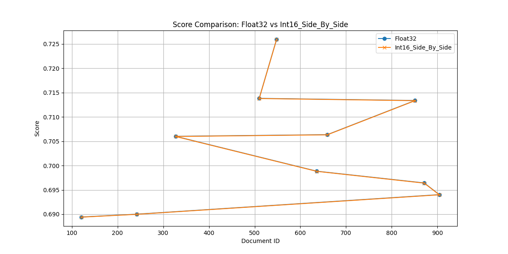

- **Percentage Differences:**
  

- **Side by Side Percentage Differences:**
  

**Int8**

- **Score Comparison:**
  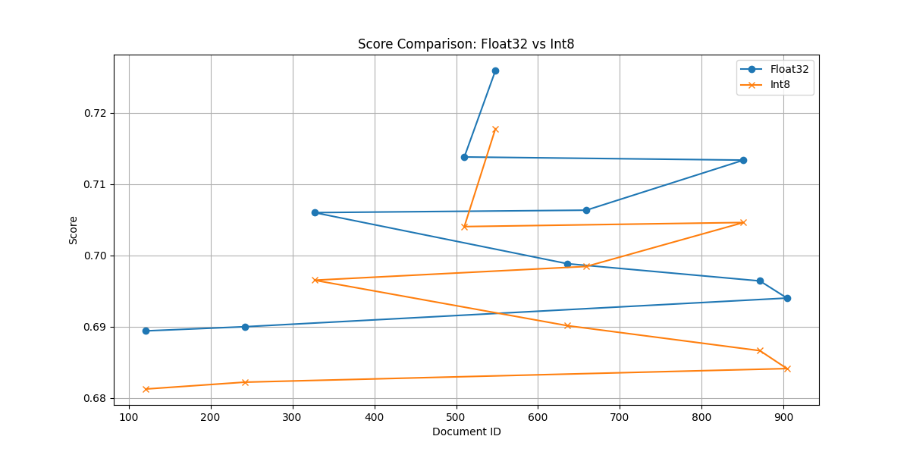

- **Side by Side Score Comparison:**
  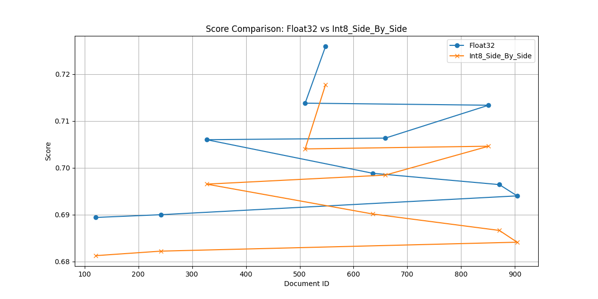

- **Percentage Differences:**
  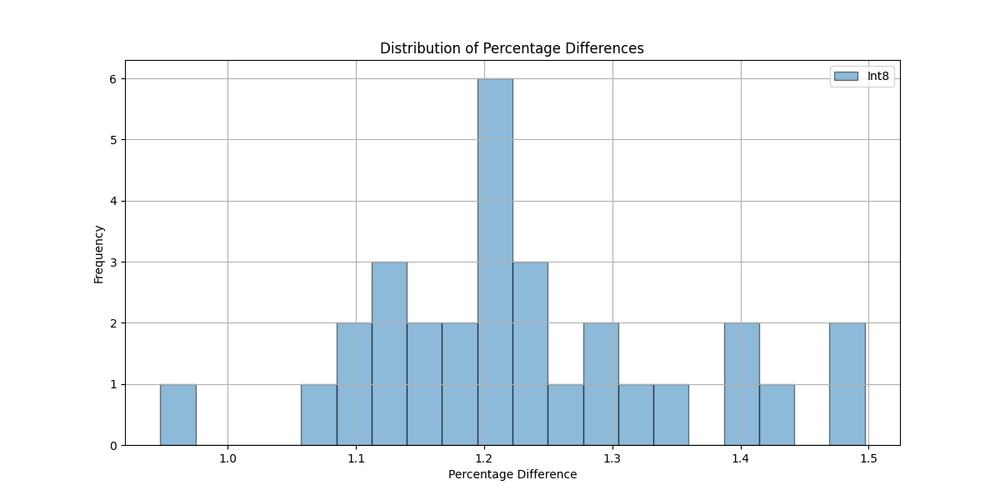

- **Side by Side Percentage Differences:**
  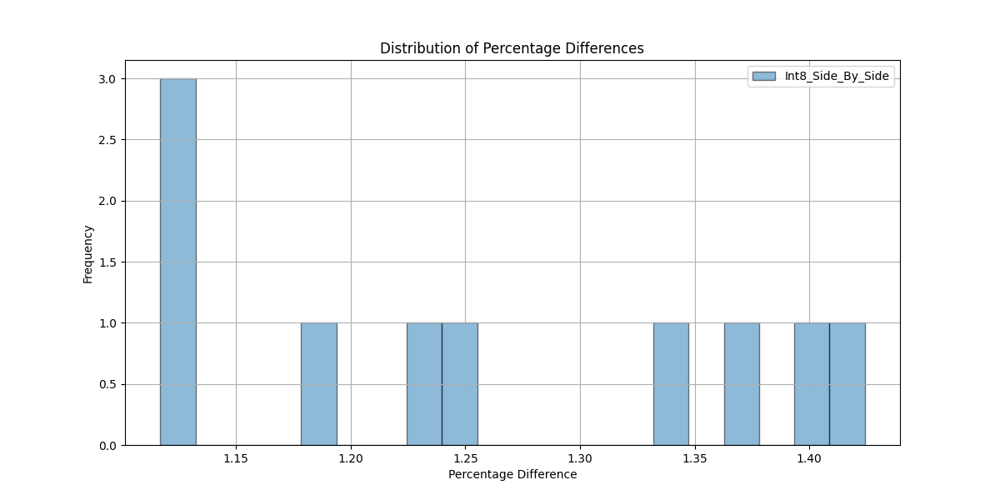

**Int4**

- **Score Comparison:**
  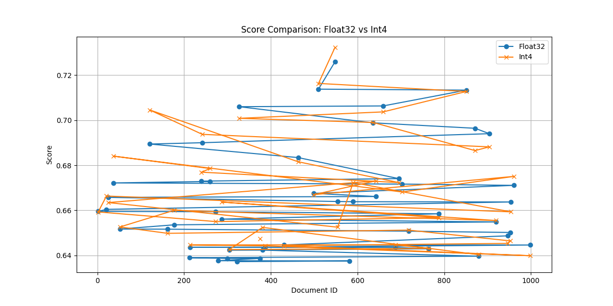

- **Side by Side Score Comparison:**
  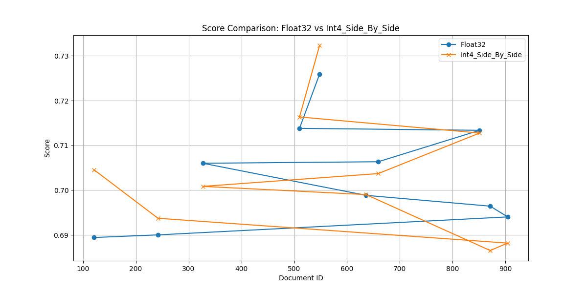

- **Percentage Differences:**
  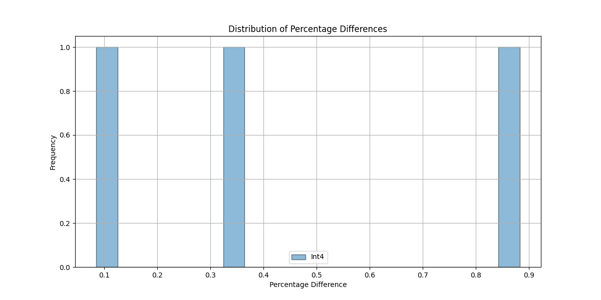

- **Side by Side Percentage Differences:**
  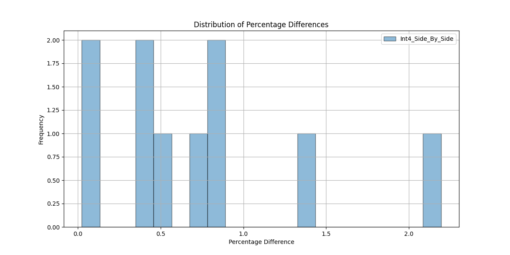

#### Global Quantization

**Int16Global**

- **Score Comparison:**
  

- **Side by Side Score Comparison:**
  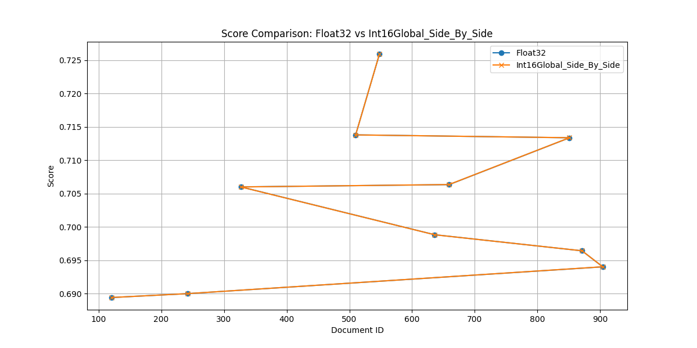

- **Percentage Differences:**
  

- **Side by Side Percentage Differences:**
  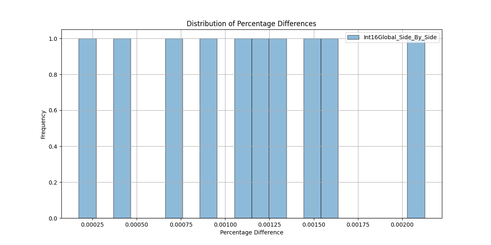

**Int8Global**

- **Score Comparison:**
  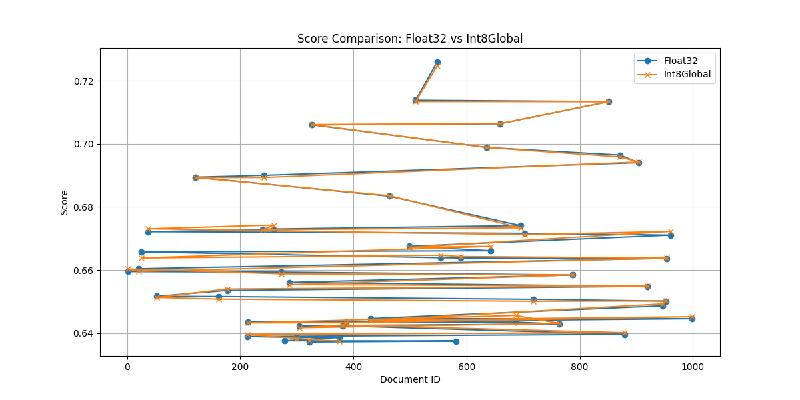

- **Side by Side Score Comparison:**
  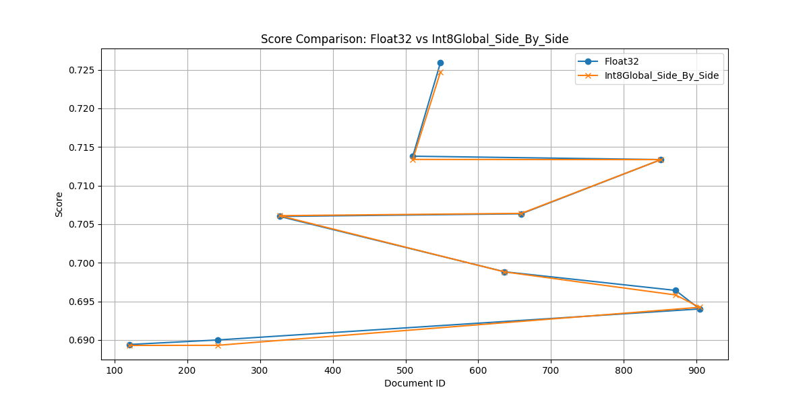

- **Percentage Differences:**
  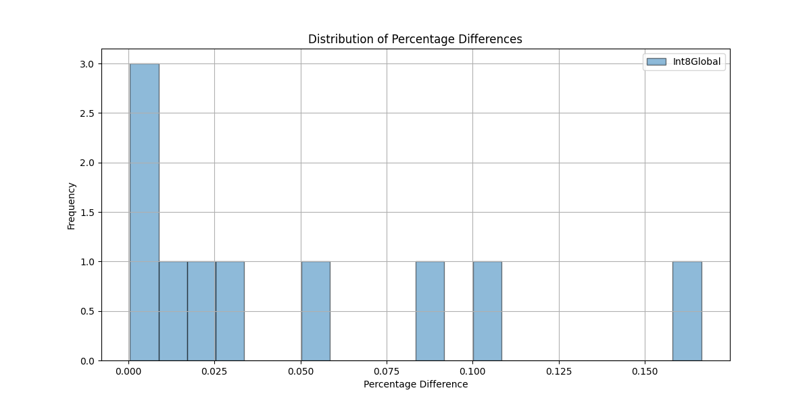

- **Side by Side Percentage Differences:**
  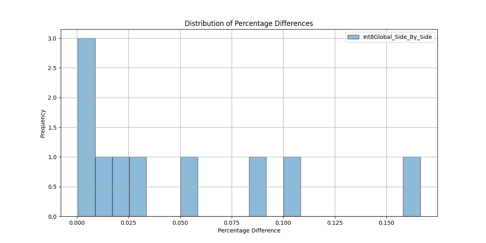

**Int4Global**

- **Score Comparison:**
  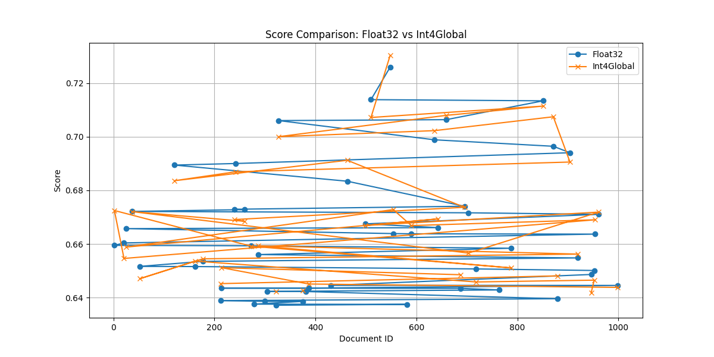

- **Side by Side Score Comparison:**
  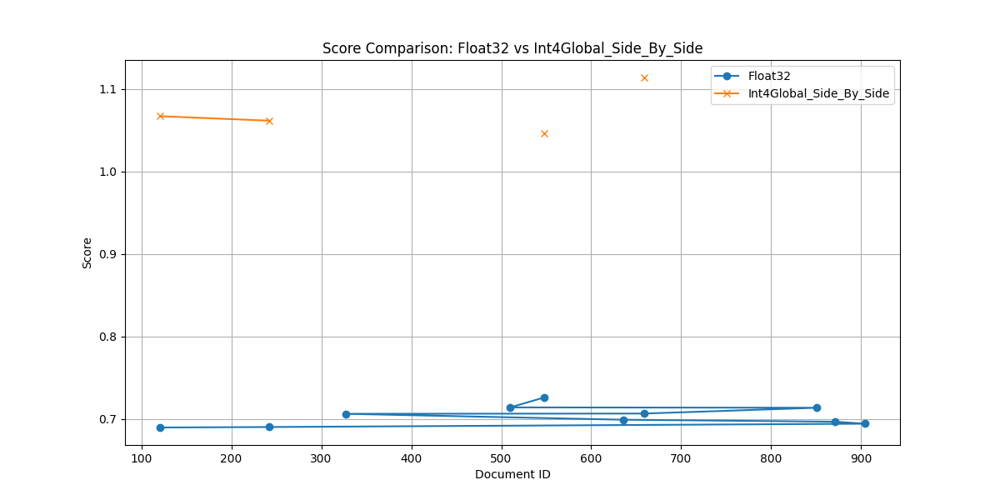

- **Percentage Differences:**
  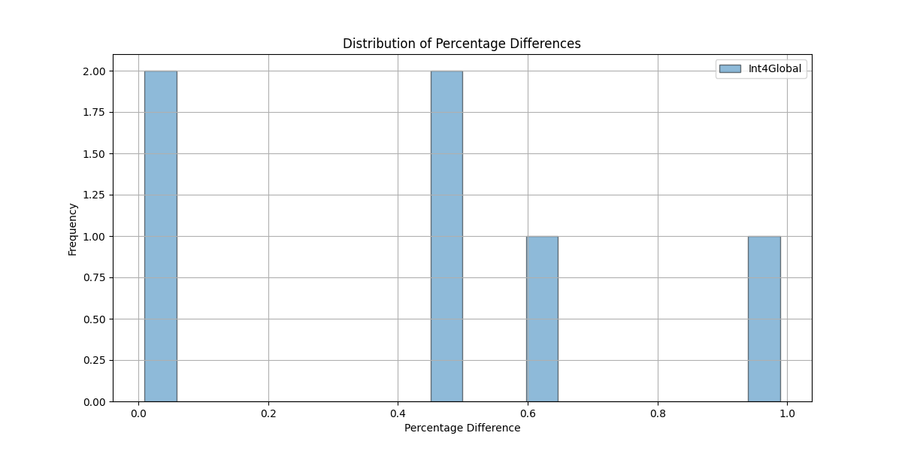

- **Side by Side Percentage Differences:**
  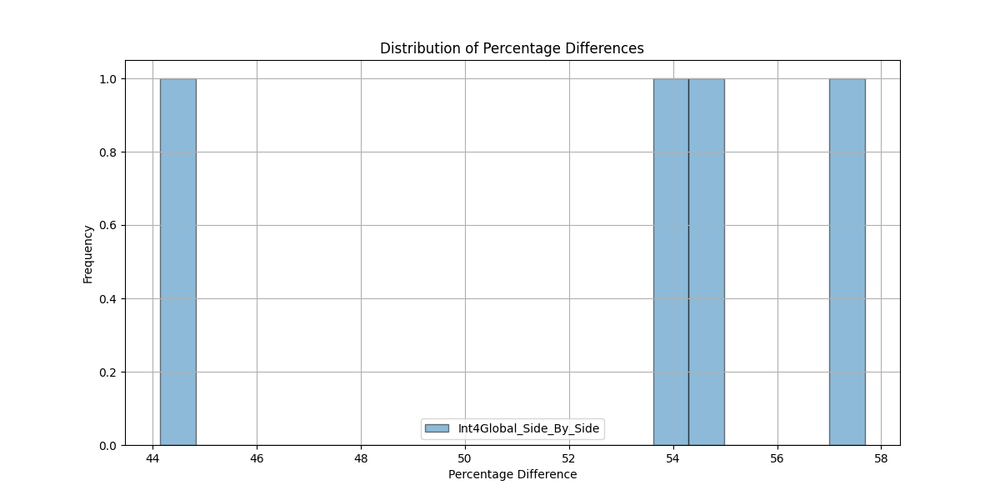

#### Combined Visualization

- **All Methods Percentage Differences:**
  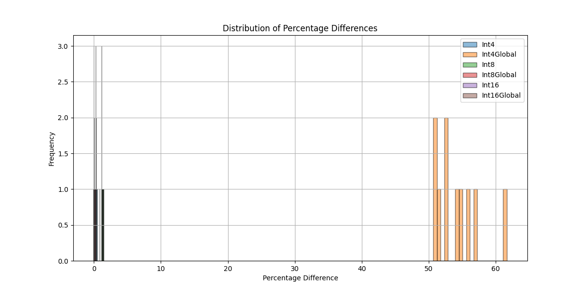


## Setup & Running

### Dependencies

Ensure Python is installed with libraries like `numpy`, `pandas`, `faiss`, `requests`, etc.

### Running the Analysis

Run the main script using the following command:

Installation and Setup Instructions

Follow these steps to set up and run the project on your machine.

Prerequisites
	•	Python 3.8+
Ensure you have Python 3.8 or later installed. You can check your version with:

```bash
python --version
```

	•	Ollama
Ollama is required to run the embedding service.
	1.	Download Ollama: Visit the Ollama Download Page and follow the installation instructions for your operating system.
	2.	Run Ollama: Once installed, start the Ollama server if it does not automatically start. Check the documentation for your platform.


Installation Steps
	1.	Install Python Dependencies
Open your terminal, navigate to the project directory, and run:

```bash
pip install -r dependencies.txt
```


2.	Pull the Embedding Model with Ollama
Use the following command to download the embedding model:

```bash
ollama pull snowflake-arctic-embed2
```

	3.	Run the Project
Execute the main script to start processing documents and generating results:

```bash
python main.py
```

```bash
Running main.py (all local + global workflows)...
2025-02-12 15:22:21,660 [INFO] Removing existing directory: img
2025-02-12 15:22:21,677 [INFO] Creating new directory: img
2025-02-12 15:22:21,683 [INFO] Loaded 1000 documents from Generated_AI_Examples.csv.
2025-02-12 15:22:21,683 [INFO]
Starting Int4 Method...
2025-02-12 15:22:21,683 [INFO] === Single-Stage Int4 (Local) ===
2025-02-12 15:22:21,683 [INFO] Removing existing directory: ./db_int4
2025-02-12 15:22:21,696 [INFO] New FAISS index created with embedding dimension 1024.
2025-02-12 15:22:21,711 [INFO] Adding documents to Int4 DB...
Indexing docs (Int4): 100%|████████████████████████████████████████████████████████████| 1000/1000 [01:04<00:00, 15.46it/s]
2025-02-12 15:23:26,415 [INFO] FAISS index saved to disk.
2025-02-12 15:23:26,829 [INFO] Search Results (Float32 vs. Int4):
2025-02-12 15:23:26,829 [INFO] QUERY:
2025-02-12 15:23:26,829 [INFO] Artificial intelligence is transforming industries.
2025-02-12 15:23:26,829 [INFO]
Comparison of Scores (Float32 vs. Int4):
2025-02-12 15:23:26,829 [INFO] Doc ID: 548, Float32 Score: 0.72592282, Int4 Score: 0.73232877, Difference: 0.00640595, Difference%: 0.8825%
2025-02-12 15:23:26,829 [INFO] Doc ID: 510, Float32 Score: 0.71380323, Int4 Score: 0.71634406, Difference: 0.00254083, Difference%: 0.3560%
2025-02-12 15:23:26,829 [INFO] Doc ID: 851, Float32 Score: 0.71336526, Int4 Score: 0.71275973, Difference: 0.00060552, Difference%: 0.0849%
2025-02-12 15:23:26,829 [WARNING] Document IDs do not match: Float32 Doc ID=659 vs Quantized Doc ID=121.
2025-02-12 15:23:26,829 [WARNING] Document IDs do not match: Float32 Doc ID=327 vs Quantized Doc ID=659.
2025-02-12 15:23:26,829 [WARNING] Document IDs do not match: Float32 Doc ID=636 vs Quantized Doc ID=327.
2025-02-12 15:23:26,829 [WARNING] Document IDs do not match: Float32 Doc ID=871 vs Quantized Doc ID=636.
2025-02-12 15:23:26,829 [WARNING] Document IDs do not match: Float32 Doc ID=904 vs Quantized Doc ID=242.
2025-02-12 15:23:26,829 [WARNING] Document IDs do not match: Float32 Doc ID=242 vs Quantized Doc ID=904.
2025-02-12 15:23:26,829 [WARNING] Document IDs do not match: Float32 Doc ID=121 vs Quantized Doc ID=871.
2025-02-12 15:23:26,833 [INFO]
=== Summary of Percentage Differences for Int4 ===
2025-02-12 15:23:26,833 [INFO] Average Percentage Difference: 0.4411%
2025-02-12 15:23:26,833 [INFO] Median Percentage Difference: 0.3560%
2025-02-12 15:23:26,833 [INFO] Maximum Percentage Difference: 0.8825%
2025-02-12 15:23:26,833 [INFO] Minimum Percentage Difference: 0.0849%
2025-02-12 15:23:27,247 [INFO] QUERY:
2025-02-12 15:23:27,247 [INFO] Artificial intelligence is transforming industries.
2025-02-12 15:23:27,247 [INFO]
=== Detailed Score Comparison: Float32 vs. Int4 Side By Side ===
2025-02-12 15:23:27,247 [INFO] Doc ID=548, float32=0.72592282, Int4 Side By Side=0.73232877, diff=0.00640595, diff%=0.8825%, doc='AI is revolutionizing human-computer interaction....'
2025-02-12 15:23:27,247 [INFO] Doc ID=510, float32=0.71380323, Int4 Side By Side=0.71634406, diff=0.00254083, diff%=0.3560%, doc='AI is transforming smart city planning....'
2025-02-12 15:23:27,247 [INFO] Doc ID=851, float32=0.71336526, Int4 Side By Side=0.71275973, diff=0.00060552, diff%=0.0849%, doc='AI is transforming supply chain optimization....'
2025-02-12 15:23:27,247 [INFO] Doc ID=659, float32=0.70634353, Int4 Side By Side=0.70370036, diff=0.00264317, diff%=0.3742%, doc='AI in sports is transforming manufacturing processes....'
2025-02-12 15:23:27,247 [INFO] Doc ID=327, float32=0.70600551, Int4 Side By Side=0.70084161, diff=0.00516391, diff%=0.7314%, doc='AI is transforming traffic management....'
2025-02-12 15:23:27,249 [INFO] Doc ID=636, float32=0.69883746, Int4 Side By Side=0.69900727, diff=0.00016981, diff%=0.0243%, doc='AI simplifies energy efficiency....'
2025-02-12 15:23:27,249 [INFO] Doc ID=871, float32=0.69642389, Int4 Side By Side=0.68651408, diff=0.00990981, diff%=1.4230%, doc='Smart cities is transforming artificial intelligence researc...'
2025-02-12 15:23:27,249 [INFO] Doc ID=904, float32=0.69402176, Int4 Side By Side=0.68816990, diff=0.00585186, diff%=0.8432%, doc='AI improves artificial intelligence research....'
2025-02-12 15:23:27,249 [INFO] Doc ID=242, float32=0.69000554, Int4 Side By Side=0.69372189, diff=0.00371635, diff%=0.5386%, doc='AI is transforming cybersecurity systems....'
2025-02-12 15:23:27,249 [INFO] Doc ID=121, float32=0.68942094, Int4 Side By Side=0.70454550, diff=0.01512456, diff%=2.1938%, doc='Generative AI aids in manufacturing processes....'
2025-02-12 15:23:27,249 [INFO]
=== Summary of Percentage Differences for Int4 Side By Side ===
2025-02-12 15:23:27,249 [INFO] Average Percentage Difference: 0.7452%
2025-02-12 15:23:27,249 [INFO] Median Percentage Difference: 0.6350%
2025-02-12 15:23:27,249 [INFO] Maximum Percentage Difference: 2.1938%
2025-02-12 15:23:27,249 [INFO] Minimum Percentage Difference: 0.0243%
2025-02-12 15:23:27,453 [INFO] Results saved for Int4 to results.csv
2025-02-12 15:23:27,488 [INFO] Completed Int4 Method.
2025-02-12 15:23:27,492 [INFO]
Starting Int4Global Method...
2025-02-12 15:23:27,492 [INFO] === Single-Stage Int4 (Global) ===
2025-02-12 15:23:27,492 [INFO] Removing existing directory: ./db_int4_global
2025-02-12 15:23:27,496 [INFO] New FAISS index created with embedding dimension 1024.
2025-02-12 15:23:27,502 [INFO] Adding documents to Int4Global DB...
Indexing docs (Global Int4): 100%|█████████████████████████████████████████████████████| 1000/1000 [01:01<00:00, 16.17it/s]
2025-02-12 15:24:29,328 [INFO] FAISS index saved to disk.
2025-02-12 15:24:29,634 [INFO] Search Results (Float32 vs. Int4Global):
2025-02-12 15:24:29,634 [INFO] QUERY:
2025-02-12 15:24:29,634 [INFO] Artificial intelligence is transforming industries.
2025-02-12 15:24:29,634 [INFO]
Comparison of Scores (Float32 vs. Int4Global):
2025-02-12 15:24:29,634 [WARNING] Document IDs do not match: Float32 Doc ID=548 vs Quantized Doc ID=695.
2025-02-12 15:24:29,634 [WARNING] Document IDs do not match: Float32 Doc ID=510 vs Quantized Doc ID=919.
2025-02-12 15:24:29,634 [WARNING] Document IDs do not match: Float32 Doc ID=851 vs Quantized Doc ID=659.
2025-02-12 15:24:29,634 [WARNING] Document IDs do not match: Float32 Doc ID=659 vs Quantized Doc ID=954.
2025-02-12 15:24:29,634 [WARNING] Document IDs do not match: Float32 Doc ID=327 vs Quantized Doc ID=764.
2025-02-12 15:24:29,635 [WARNING] Document IDs do not match: Float32 Doc ID=636 vs Quantized Doc ID=121.
2025-02-12 15:24:29,635 [WARNING] Document IDs do not match: Float32 Doc ID=871 vs Quantized Doc ID=242.
2025-02-12 15:24:29,635 [WARNING] Document IDs do not match: Float32 Doc ID=904 vs Quantized Doc ID=548.
2025-02-12 15:24:29,635 [WARNING] Document IDs do not match: Float32 Doc ID=242 vs Quantized Doc ID=961.
2025-02-12 15:24:29,635 [WARNING] Document IDs do not match: Float32 Doc ID=121 vs Quantized Doc ID=5.
2025-02-12 15:24:29,635 [INFO] No matching documents to compare.
2025-02-12 15:24:29,635 [INFO] QUERY:
2025-02-12 15:24:29,635 [INFO] Artificial intelligence is transforming industries.
2025-02-12 15:24:29,635 [INFO]
=== Detailed Score Comparison: Float32 vs. Int4Global Side By Side ===
2025-02-12 15:24:29,635 [INFO] Doc ID=695, float32=None, Int4Global Side By Side=1.17340481, diff%='N/A', doc='AI in education is revolutionizing manufacturing processes....'
2025-02-12 15:24:29,635 [INFO] Doc ID=919, float32=None, Int4Global Side By Side=1.12119889, diff%='N/A', doc='AI in the legal field simplifies manufacturing processes....'
2025-02-12 15:24:29,635 [INFO] Doc ID=954, float32=None, Int4Global Side By Side=1.09432721, diff%='N/A', doc='AI in sports ensures manufacturing processes....'
2025-02-12 15:24:29,635 [INFO] Doc ID=764, float32=None, Int4Global Side By Side=1.08712840, diff%='N/A', doc='AI in agriculture is transforming education personalization....'
2025-02-12 15:24:29,635 [INFO] Doc ID=961, float32=None, Int4Global Side By Side=1.04494882, diff%='N/A', doc='AI in sports streamlines manufacturing processes....'
2025-02-12 15:24:29,635 [INFO] Doc ID=5, float32=None, Int4Global Side By Side=1.03871179, diff%='N/A', doc='AI in agriculture reduces costs in artificial intelligence r...'
2025-02-12 15:24:29,635 [INFO] Doc ID=548, float32=0.72592282, Int4Global Side By Side=1.04641032, diff=0.32048750, diff%=44.1490%, doc='AI is revolutionizing human-computer interaction....'
2025-02-12 15:24:29,635 [INFO] Doc ID=510, float32=0.71380323, Int4Global Side By Side=None, diff%='N/A', doc='AI is transforming smart city planning....'
2025-02-12 15:24:29,635 [INFO] Doc ID=851, float32=0.71336526, Int4Global Side By Side=None, diff%='N/A', doc='AI is transforming supply chain optimization....'
2025-02-12 15:24:29,635 [INFO] Doc ID=659, float32=0.70634353, Int4Global Side By Side=1.11379147, diff=0.40744793, diff%=57.6841%, doc='AI in sports is transforming manufacturing processes....'
2025-02-12 15:24:29,635 [INFO] Doc ID=327, float32=0.70600551, Int4Global Side By Side=None, diff%='N/A', doc='AI is transforming traffic management....'
2025-02-12 15:24:29,635 [INFO] Doc ID=636, float32=0.69883746, Int4Global Side By Side=None, diff%='N/A', doc='AI simplifies energy efficiency....'
2025-02-12 15:24:29,635 [INFO] Doc ID=871, float32=0.69642389, Int4Global Side By Side=None, diff%='N/A', doc='Smart cities is transforming artificial intelligence researc...'
2025-02-12 15:24:29,635 [INFO] Doc ID=904, float32=0.69402176, Int4Global Side By Side=None, diff%='N/A', doc='AI improves artificial intelligence research....'
2025-02-12 15:24:29,635 [INFO] Doc ID=242, float32=0.69000554, Int4Global Side By Side=1.06144822, diff=0.37144268, diff%=53.8318%, doc='AI is transforming cybersecurity systems....'
2025-02-12 15:24:29,635 [INFO] Doc ID=121, float32=0.68942094, Int4Global Side By Side=1.06685436, diff=0.37743342, diff%=54.7464%, doc='Generative AI aids in manufacturing processes....'
2025-02-12 15:24:29,635 [INFO]
=== Summary of Percentage Differences for Int4Global Side By Side ===
2025-02-12 15:24:29,635 [INFO] Average Percentage Difference: 52.6028%
2025-02-12 15:24:29,635 [INFO] Median Percentage Difference: 54.2891%
2025-02-12 15:24:29,635 [INFO] Maximum Percentage Difference: 57.6841%
2025-02-12 15:24:29,635 [INFO] Minimum Percentage Difference: 44.1490%
2025-02-12 15:24:29,820 [INFO] Results saved for Int4Global to results.csv
2025-02-12 15:24:29,826 [INFO] Completed Int4Global Method.
2025-02-12 15:24:29,827 [INFO]
Starting Int8 Method...
2025-02-12 15:24:29,827 [INFO] === Single-Stage Int8 (Local) ===
2025-02-12 15:24:29,827 [INFO] Removing existing directory: ./db_int8
2025-02-12 15:24:29,830 [INFO] New FAISS index created with embedding dimension 1024.
2025-02-12 15:24:29,834 [INFO] Adding documents to Int8 DB...
Indexing docs (Int8): 100%|████████████████████████████████████████████████████████████| 1000/1000 [00:59<00:00, 16.80it/s]
2025-02-12 15:25:29,343 [INFO] FAISS index saved to disk.
2025-02-12 15:25:29,472 [INFO] Search Results (Float32 vs. Int8):
2025-02-12 15:25:29,472 [INFO] QUERY:
2025-02-12 15:25:29,472 [INFO] Artificial intelligence is transforming industries.
2025-02-12 15:25:29,472 [INFO]
Comparison of Scores (Float32 vs. Int8):
2025-02-12 15:25:29,472 [INFO] Doc ID: 548, Float32 Score: 0.72592282, Int8 Score: 0.71776712, Difference: 0.00815570, Difference%: 1.1235%
2025-02-12 15:25:29,472 [WARNING] Document IDs do not match: Float32 Doc ID=510 vs Quantized Doc ID=851.
2025-02-12 15:25:29,472 [WARNING] Document IDs do not match: Float32 Doc ID=851 vs Quantized Doc ID=510.
2025-02-12 15:25:29,472 [INFO] Doc ID: 659, Float32 Score: 0.70634353, Int8 Score: 0.69845378, Difference: 0.00788975, Difference%: 1.1170%
2025-02-12 15:25:29,472 [INFO] Doc ID: 327, Float32 Score: 0.70600551, Int8 Score: 0.69652700, Difference: 0.00947851, Difference%: 1.3426%
2025-02-12 15:25:29,472 [INFO] Doc ID: 636, Float32 Score: 0.69883746, Int8 Score: 0.69014907, Difference: 0.00868839, Difference%: 1.2433%
2025-02-12 15:25:29,472 [INFO] Doc ID: 871, Float32 Score: 0.69642389, Int8 Score: 0.68664753, Difference: 0.00977635, Difference%: 1.4038%
2025-02-12 15:25:29,472 [INFO] Doc ID: 904, Float32 Score: 0.69402176, Int8 Score: 0.68413794, Difference: 0.00988382, Difference%: 1.4241%
2025-02-12 15:25:29,472 [INFO] Doc ID: 242, Float32 Score: 0.69000554, Int8 Score: 0.68223262, Difference: 0.00777292, Difference%: 1.1265%
2025-02-12 15:25:29,472 [INFO] Doc ID: 121, Float32 Score: 0.68942094, Int8 Score: 0.68127036, Difference: 0.00815058, Difference%: 1.1822%
2025-02-12 15:25:29,473 [INFO]
=== Summary of Percentage Differences for Int8 ===
2025-02-12 15:25:29,473 [INFO] Average Percentage Difference: 1.2454%
2025-02-12 15:25:29,473 [INFO] Median Percentage Difference: 1.2127%
2025-02-12 15:25:29,473 [INFO] Maximum Percentage Difference: 1.4241%
2025-02-12 15:25:29,473 [INFO] Minimum Percentage Difference: 1.1170%
2025-02-12 15:25:29,658 [INFO] QUERY:
2025-02-12 15:25:29,658 [INFO] Artificial intelligence is transforming industries.
2025-02-12 15:25:29,658 [INFO]
=== Detailed Score Comparison: Float32 vs. Int8 Side By Side ===
2025-02-12 15:25:29,658 [INFO] Doc ID=548, float32=0.72592282, Int8 Side By Side=0.71776712, diff=0.00815570, diff%=1.1235%, doc='AI is revolutionizing human-computer interaction....'
2025-02-12 15:25:29,658 [INFO] Doc ID=510, float32=0.71380323, Int8 Side By Side=0.70404428, diff=0.00975895, diff%=1.3672%, doc='AI is transforming smart city planning....'
2025-02-12 15:25:29,658 [INFO] Doc ID=851, float32=0.71336526, Int8 Side By Side=0.70461822, diff=0.00874704, diff%=1.2262%, doc='AI is transforming supply chain optimization....'
2025-02-12 15:25:29,658 [INFO] Doc ID=659, float32=0.70634353, Int8 Side By Side=0.69845378, diff=0.00788975, diff%=1.1170%, doc='AI in sports is transforming manufacturing processes....'
2025-02-12 15:25:29,658 [INFO] Doc ID=327, float32=0.70600551, Int8 Side By Side=0.69652700, diff=0.00947851, diff%=1.3426%, doc='AI is transforming traffic management....'
2025-02-12 15:25:29,658 [INFO] Doc ID=636, float32=0.69883746, Int8 Side By Side=0.69014907, diff=0.00868839, diff%=1.2433%, doc='AI simplifies energy efficiency....'
2025-02-12 15:25:29,658 [INFO] Doc ID=871, float32=0.69642389, Int8 Side By Side=0.68664753, diff=0.00977635, diff%=1.4038%, doc='Smart cities is transforming artificial intelligence researc...'
2025-02-12 15:25:29,658 [INFO] Doc ID=904, float32=0.69402176, Int8 Side By Side=0.68413794, diff=0.00988382, diff%=1.4241%, doc='AI improves artificial intelligence research....'
2025-02-12 15:25:29,658 [INFO] Doc ID=242, float32=0.69000554, Int8 Side By Side=0.68223262, diff=0.00777292, diff%=1.1265%, doc='AI is transforming cybersecurity systems....'
2025-02-12 15:25:29,658 [INFO] Doc ID=121, float32=0.68942094, Int8 Side By Side=0.68127036, diff=0.00815058, diff%=1.1822%, doc='Generative AI aids in manufacturing processes....'
2025-02-12 15:25:29,658 [INFO]
=== Summary of Percentage Differences for Int8 Side By Side ===
2025-02-12 15:25:29,658 [INFO] Average Percentage Difference: 1.2556%
2025-02-12 15:25:29,658 [INFO] Median Percentage Difference: 1.2347%
2025-02-12 15:25:29,658 [INFO] Maximum Percentage Difference: 1.4241%
2025-02-12 15:25:29,658 [INFO] Minimum Percentage Difference: 1.1170%
2025-02-12 15:25:29,833 [INFO] Results saved for Int8 to results.csv
2025-02-12 15:25:29,841 [INFO] Completed Int8 Method.
2025-02-12 15:25:29,842 [INFO]
Starting Int8Global Method...
2025-02-12 15:25:29,842 [INFO] === Single-Stage Int8 (Global) ===
2025-02-12 15:25:29,842 [INFO] Removing existing directory: ./db_int8_global
2025-02-12 15:25:29,845 [INFO] New FAISS index created with embedding dimension 1024.
2025-02-12 15:25:29,851 [INFO] Adding documents to Int8Global DB...
2025-02-12 15:25:29,851 [INFO] QUERY:
2025-02-12 15:25:29,851 [INFO] Artificial intelligence is transforming industries.
Indexing docs (Global Int8): 100%|█████████████████████████████████████████████████████| 1000/1000 [01:03<00:00, 15.66it/s]
2025-02-12 15:26:33,699 [INFO] FAISS index saved to disk.
2025-02-12 15:26:33,837 [INFO] Search Results (Float32 vs. Int8Global):
2025-02-12 15:26:33,837 [INFO] QUERY:
2025-02-12 15:26:33,837 [INFO] Artificial intelligence is transforming industries.
2025-02-12 15:26:33,837 [INFO]
Comparison of Scores (Float32 vs. Int8Global):
2025-02-12 15:26:33,837 [INFO] Doc ID: 548, Float32 Score: 0.72592282, Int8Global Score: 0.72471464, Difference: 0.00120819, Difference%: 0.1664%
2025-02-12 15:26:33,837 [INFO] Doc ID: 510, Float32 Score: 0.71380323, Int8Global Score: 0.71338582, Difference: 0.00041741, Difference%: 0.0585%
2025-02-12 15:26:33,837 [INFO] Doc ID: 851, Float32 Score: 0.71336526, Int8Global Score: 0.71336192, Difference: 0.00000334, Difference%: 0.0005%
2025-02-12 15:26:33,837 [INFO] Doc ID: 659, Float32 Score: 0.70634353, Int8Global Score: 0.70639586, Difference: 0.00005233, Difference%: 0.0074%
2025-02-12 15:26:33,837 [INFO] Doc ID: 327, Float32 Score: 0.70600551, Int8Global Score: 0.70610368, Difference: 0.00009817, Difference%: 0.0139%
2025-02-12 15:26:33,837 [INFO] Doc ID: 636, Float32 Score: 0.69883746, Int8Global Score: 0.69882244, Difference: 0.00001502, Difference%: 0.0021%
2025-02-12 15:26:33,837 [INFO] Doc ID: 871, Float32 Score: 0.69642389, Int8Global Score: 0.69583344, Difference: 0.00059044, Difference%: 0.0848%
2025-02-12 15:26:33,838 [INFO] Doc ID: 904, Float32 Score: 0.69402176, Int8Global Score: 0.69423646, Difference: 0.00021470, Difference%: 0.0309%
2025-02-12 15:26:33,838 [INFO] Doc ID: 242, Float32 Score: 0.69000554, Int8Global Score: 0.68931419, Difference: 0.00069135, Difference%: 0.1002%
2025-02-12 15:26:33,838 [INFO] Doc ID: 121, Float32 Score: 0.68942094, Int8Global Score: 0.68929815, Difference: 0.00012279, Difference%: 0.0178%
2025-02-12 15:26:33,838 [INFO]
=== Summary of Percentage Differences for Int8Global ===
2025-02-12 15:26:33,838 [INFO] Average Percentage Difference: 0.0483%
2025-02-12 15:26:33,838 [INFO] Median Percentage Difference: 0.0244%
2025-02-12 15:26:33,838 [INFO] Maximum Percentage Difference: 0.1664%
2025-02-12 15:26:33,838 [INFO] Minimum Percentage Difference: 0.0005%
2025-02-12 15:26:34,077 [INFO] QUERY:
2025-02-12 15:26:34,077 [INFO] Artificial intelligence is transforming industries.
2025-02-12 15:26:34,077 [INFO]
=== Detailed Score Comparison: Float32 vs. Int8Global Side By Side ===
2025-02-12 15:26:34,077 [INFO] Doc ID=548, float32=0.72592282, Int8Global Side By Side=0.72471464, diff=0.00120819, diff%=0.1664%, doc='AI is revolutionizing human-computer interaction....'
2025-02-12 15:26:34,077 [INFO] Doc ID=510, float32=0.71380323, Int8Global Side By Side=0.71338582, diff=0.00041741, diff%=0.0585%, doc='AI is transforming smart city planning....'
2025-02-12 15:26:34,077 [INFO] Doc ID=851, float32=0.71336526, Int8Global Side By Side=0.71336192, diff=0.00000334, diff%=0.0005%, doc='AI is transforming supply chain optimization....'
2025-02-12 15:26:34,077 [INFO] Doc ID=659, float32=0.70634353, Int8Global Side By Side=0.70639586, diff=0.00005233, diff%=0.0074%, doc='AI in sports is transforming manufacturing processes....'
2025-02-12 15:26:34,077 [INFO] Doc ID=327, float32=0.70600551, Int8Global Side By Side=0.70610368, diff=0.00009817, diff%=0.0139%, doc='AI is transforming traffic management....'
2025-02-12 15:26:34,077 [INFO] Doc ID=636, float32=0.69883746, Int8Global Side By Side=0.69882244, diff=0.00001502, diff%=0.0021%, doc='AI simplifies energy efficiency....'
2025-02-12 15:26:34,077 [INFO] Doc ID=871, float32=0.69642389, Int8Global Side By Side=0.69583344, diff=0.00059044, diff%=0.0848%, doc='Smart cities is transforming artificial intelligence researc...'
2025-02-12 15:26:34,077 [INFO] Doc ID=904, float32=0.69402176, Int8Global Side By Side=0.69423646, diff=0.00021470, diff%=0.0309%, doc='AI improves artificial intelligence research....'
2025-02-12 15:26:34,077 [INFO] Doc ID=242, float32=0.69000554, Int8Global Side By Side=0.68931419, diff=0.00069135, diff%=0.1002%, doc='AI is transforming cybersecurity systems....'
2025-02-12 15:26:34,077 [INFO] Doc ID=121, float32=0.68942094, Int8Global Side By Side=0.68929815, diff=0.00012279, diff%=0.0178%, doc='Generative AI aids in manufacturing processes....'
2025-02-12 15:26:34,077 [INFO]
=== Summary of Percentage Differences for Int8Global Side By Side ===
2025-02-12 15:26:34,077 [INFO] Average Percentage Difference: 0.0483%
2025-02-12 15:26:34,078 [INFO] Median Percentage Difference: 0.0244%
2025-02-12 15:26:34,078 [INFO] Maximum Percentage Difference: 0.1664%
2025-02-12 15:26:34,078 [INFO] Minimum Percentage Difference: 0.0005%
2025-02-12 15:26:34,250 [INFO] Results saved for Int8Global to results.csv
2025-02-12 15:26:34,257 [INFO] Completed Int8Global Method.
2025-02-12 15:26:34,260 [INFO]
Starting Int16 Method...
2025-02-12 15:26:34,260 [INFO] === Single-Stage Int16 (Local) ===
2025-02-12 15:26:34,260 [INFO] Removing existing directory: ./db_int16
2025-02-12 15:26:34,263 [INFO] New FAISS index created with embedding dimension 1024.
2025-02-12 15:26:34,266 [INFO] Adding documents to Int16 DB...
Indexing docs: 100%|███████████████████████████████████████████████████████████████████| 1000/1000 [00:58<00:00, 17.00it/s]
2025-02-12 15:27:33,097 [INFO] FAISS index saved to disk.
2025-02-12 15:27:33,261 [INFO] Search Results (Float32 vs. Int16):
2025-02-12 15:27:33,261 [INFO] QUERY:
2025-02-12 15:27:33,261 [INFO] Artificial intelligence is transforming industries.
2025-02-12 15:27:33,261 [INFO]
Comparison of Scores (Float32 vs. Int16):
2025-02-12 15:27:33,261 [INFO] Doc ID: 548, Float32 Score: 0.72592284, Int16 Score: 0.72589112, Difference: 0.00003172, Difference%: 0.0044%
2025-02-12 15:27:33,261 [INFO] Doc ID: 510, Float32 Score: 0.71380321, Int16 Score: 0.71376745, Difference: 0.00003576, Difference%: 0.0050%
2025-02-12 15:27:33,261 [INFO] Doc ID: 851, Float32 Score: 0.71336530, Int16 Score: 0.71333100, Difference: 0.00003430, Difference%: 0.0048%
2025-02-12 15:27:33,261 [INFO] Doc ID: 659, Float32 Score: 0.70634353, Int16 Score: 0.70631148, Difference: 0.00003204, Difference%: 0.0045%
2025-02-12 15:27:33,261 [INFO] Doc ID: 327, Float32 Score: 0.70600552, Int16 Score: 0.70596898, Difference: 0.00003654, Difference%: 0.0052%
2025-02-12 15:27:33,261 [INFO] Doc ID: 636, Float32 Score: 0.69883747, Int16 Score: 0.69880504, Difference: 0.00003243, Difference%: 0.0046%
2025-02-12 15:27:33,261 [INFO] Doc ID: 871, Float32 Score: 0.69642394, Int16 Score: 0.69638557, Difference: 0.00003837, Difference%: 0.0055%
2025-02-12 15:27:33,261 [INFO] Doc ID: 904, Float32 Score: 0.69402177, Int16 Score: 0.69398507, Difference: 0.00003670, Difference%: 0.0053%
2025-02-12 15:27:33,261 [INFO] Doc ID: 242, Float32 Score: 0.69000552, Int16 Score: 0.68997453, Difference: 0.00003099, Difference%: 0.0045%
2025-02-12 15:27:33,261 [INFO] Doc ID: 121, Float32 Score: 0.68942097, Int16 Score: 0.68939019, Difference: 0.00003078, Difference%: 0.0045%
2025-02-12 15:27:33,261 [INFO]
=== Summary of Percentage Differences for Int16 ===
2025-02-12 15:27:33,261 [INFO] Average Percentage Difference: 0.0048%
2025-02-12 15:27:33,261 [INFO] Median Percentage Difference: 0.0047%
2025-02-12 15:27:33,261 [INFO] Maximum Percentage Difference: 0.0055%
2025-02-12 15:27:33,261 [INFO] Minimum Percentage Difference: 0.0044%
2025-02-12 15:27:33,466 [INFO] QUERY:
2025-02-12 15:27:33,466 [INFO] Artificial intelligence is transforming industries.
2025-02-12 15:27:33,466 [INFO]
=== Detailed Score Comparison: Float32 vs. Int16 Side By Side ===
2025-02-12 15:27:33,466 [INFO] Doc ID=548, float32=0.72592284, Int16 Side By Side=0.72589112, diff=0.00003172, diff%=0.0044%, doc='AI is revolutionizing human-computer interaction....'
2025-02-12 15:27:33,466 [INFO] Doc ID=510, float32=0.71380321, Int16 Side By Side=0.71376745, diff=0.00003576, diff%=0.0050%, doc='AI is transforming smart city planning....'
2025-02-12 15:27:33,466 [INFO] Doc ID=851, float32=0.71336530, Int16 Side By Side=0.71333100, diff=0.00003430, diff%=0.0048%, doc='AI is transforming supply chain optimization....'
2025-02-12 15:27:33,466 [INFO] Doc ID=659, float32=0.70634353, Int16 Side By Side=0.70631148, diff=0.00003204, diff%=0.0045%, doc='AI in sports is transforming manufacturing processes....'
2025-02-12 15:27:33,466 [INFO] Doc ID=327, float32=0.70600552, Int16 Side By Side=0.70596898, diff=0.00003654, diff%=0.0052%, doc='AI is transforming traffic management....'
2025-02-12 15:27:33,466 [INFO] Doc ID=636, float32=0.69883747, Int16 Side By Side=0.69880504, diff=0.00003243, diff%=0.0046%, doc='AI simplifies energy efficiency....'
2025-02-12 15:27:33,466 [INFO] Doc ID=871, float32=0.69642394, Int16 Side By Side=0.69638557, diff=0.00003837, diff%=0.0055%, doc='Smart cities is transforming artificial intelligence researc...'
2025-02-12 15:27:33,466 [INFO] Doc ID=904, float32=0.69402177, Int16 Side By Side=0.69398507, diff=0.00003670, diff%=0.0053%, doc='AI improves artificial intelligence research....'
2025-02-12 15:27:33,466 [INFO] Doc ID=242, float32=0.69000552, Int16 Side By Side=0.68997453, diff=0.00003099, diff%=0.0045%, doc='AI is transforming cybersecurity systems....'
2025-02-12 15:27:33,466 [INFO] Doc ID=121, float32=0.68942097, Int16 Side By Side=0.68939019, diff=0.00003078, diff%=0.0045%, doc='Generative AI aids in manufacturing processes....'
2025-02-12 15:27:33,467 [INFO]
=== Summary of Percentage Differences for Int16 Side By Side ===
2025-02-12 15:27:33,467 [INFO] Average Percentage Difference: 0.0048%
2025-02-12 15:27:33,467 [INFO] Median Percentage Difference: 0.0047%
2025-02-12 15:27:33,467 [INFO] Maximum Percentage Difference: 0.0055%
2025-02-12 15:27:33,467 [INFO] Minimum Percentage Difference: 0.0044%
2025-02-12 15:27:33,639 [INFO] Results saved for Int16 to results.csv
2025-02-12 15:27:33,645 [INFO] Completed Int16 Method.
2025-02-12 15:27:33,647 [INFO]
Starting Int16Global Method...
2025-02-12 15:27:33,647 [INFO] === Single-Stage Int16 (Global) ===
2025-02-12 15:27:33,647 [INFO] Removing existing directory: ./db_int16_global
2025-02-12 15:27:33,650 [INFO] New FAISS index created with embedding dimension 1024.
2025-02-12 15:27:33,653 [INFO] Adding documents to Int16Global DB...
Indexing docs (Global Int16): 100%|████████████████████████████████████████████████████| 1000/1000 [01:03<00:00, 15.63it/s]
2025-02-12 15:28:37,621 [INFO] FAISS index saved to disk.
2025-02-12 15:28:37,798 [INFO] Search Results (Float32 vs. Int16Global):
2025-02-12 15:28:37,798 [INFO] QUERY:
2025-02-12 15:28:37,798 [INFO] Artificial intelligence is transforming industries.
2025-02-12 15:28:37,798 [INFO]
Comparison of Scores (Float32 vs. Int16Global):
2025-02-12 15:28:37,798 [INFO] Doc ID: 548, Float32 Score: 0.72592282, Int16Global Score: 0.72593093, Difference: 0.00000811, Difference%: 0.0011%
2025-02-12 15:28:37,798 [INFO] Doc ID: 510, Float32 Score: 0.71380323, Int16Global Score: 0.71379697, Difference: 0.00000626, Difference%: 0.0009%
2025-02-12 15:28:37,798 [INFO] Doc ID: 851, Float32 Score: 0.71336526, Int16Global Score: 0.71337450, Difference: 0.00000924, Difference%: 0.0013%
2025-02-12 15:28:37,798 [INFO] Doc ID: 659, Float32 Score: 0.70634353, Int16Global Score: 0.70635855, Difference: 0.00001502, Difference%: 0.0021%
2025-02-12 15:28:37,798 [INFO] Doc ID: 327, Float32 Score: 0.70600551, Int16Global Score: 0.70599443, Difference: 0.00001109, Difference%: 0.0016%
2025-02-12 15:28:37,798 [INFO] Doc ID: 636, Float32 Score: 0.69883746, Int16Global Score: 0.69882941, Difference: 0.00000805, Difference%: 0.0012%
2025-02-12 15:28:37,798 [INFO] Doc ID: 871, Float32 Score: 0.69642389, Int16Global Score: 0.69642699, Difference: 0.00000310, Difference%: 0.0004%
2025-02-12 15:28:37,798 [INFO] Doc ID: 904, Float32 Score: 0.69402176, Int16Global Score: 0.69403225, Difference: 0.00001049, Difference%: 0.0015%
2025-02-12 15:28:37,798 [INFO] Doc ID: 242, Float32 Score: 0.69000554, Int16Global Score: 0.69000673, Difference: 0.00000119, Difference%: 0.0002%
2025-02-12 15:28:37,798 [INFO] Doc ID: 121, Float32 Score: 0.68942094, Int16Global Score: 0.68942606, Difference: 0.00000513, Difference%: 0.0007%
2025-02-12 15:28:37,800 [INFO]
=== Summary of Percentage Differences for Int16Global ===
2025-02-12 15:28:37,800 [INFO] Average Percentage Difference: 0.0011%
2025-02-12 15:28:37,800 [INFO] Median Percentage Difference: 0.0011%
2025-02-12 15:28:37,800 [INFO] Maximum Percentage Difference: 0.0021%
2025-02-12 15:28:37,800 [INFO] Minimum Percentage Difference: 0.0002%
2025-02-12 15:28:38,039 [INFO] QUERY:
2025-02-12 15:28:38,040 [INFO] Artificial intelligence is transforming industries.
2025-02-12 15:28:38,040 [INFO]
=== Detailed Score Comparison: Float32 vs. Int16Global Side By Side ===
2025-02-12 15:28:38,040 [INFO] Doc ID=548, float32=0.72592282, Int16Global Side By Side=0.72593093, diff=0.00000811, diff%=0.0011%, doc='AI is revolutionizing human-computer interaction....'
2025-02-12 15:28:38,040 [INFO] Doc ID=510, float32=0.71380323, Int16Global Side By Side=0.71379697, diff=0.00000626, diff%=0.0009%, doc='AI is transforming smart city planning....'
2025-02-12 15:28:38,040 [INFO] Doc ID=851, float32=0.71336526, Int16Global Side By Side=0.71337450, diff=0.00000924, diff%=0.0013%, doc='AI is transforming supply chain optimization....'
2025-02-12 15:28:38,040 [INFO] Doc ID=659, float32=0.70634353, Int16Global Side By Side=0.70635855, diff=0.00001502, diff%=0.0021%, doc='AI in sports is transforming manufacturing processes....'
2025-02-12 15:28:38,040 [INFO] Doc ID=327, float32=0.70600551, Int16Global Side By Side=0.70599443, diff=0.00001109, diff%=0.0016%, doc='AI is transforming traffic management....'
2025-02-12 15:28:38,040 [INFO] Doc ID=636, float32=0.69883746, Int16Global Side By Side=0.69882941, diff=0.00000805, diff%=0.0012%, doc='AI simplifies energy efficiency....'
2025-02-12 15:28:38,040 [INFO] Doc ID=871, float32=0.69642389, Int16Global Side By Side=0.69642699, diff=0.00000310, diff%=0.0004%, doc='Smart cities is transforming artificial intelligence researc...'
2025-02-12 15:28:38,040 [INFO] Doc ID=904, float32=0.69402176, Int16Global Side By Side=0.69403225, diff=0.00001049, diff%=0.0015%, doc='AI improves artificial intelligence research....'
2025-02-12 15:28:38,040 [INFO] Doc ID=242, float32=0.69000554, Int16Global Side By Side=0.69000673, diff=0.00000119, diff%=0.0002%, doc='AI is transforming cybersecurity systems....'
2025-02-12 15:28:38,040 [INFO] Doc ID=121, float32=0.68942094, Int16Global Side By Side=0.68942606, diff=0.00000513, diff%=0.0007%, doc='Generative AI aids in manufacturing processes....'
2025-02-12 15:28:38,040 [INFO]
=== Summary of Percentage Differences for Int16Global Side By Side ===
2025-02-12 15:28:38,040 [INFO] Average Percentage Difference: 0.0011%
2025-02-12 15:28:38,040 [INFO] Median Percentage Difference: 0.0011%
2025-02-12 15:28:38,040 [INFO] Maximum Percentage Difference: 0.0021%
2025-02-12 15:28:38,040 [INFO] Minimum Percentage Difference: 0.0002%
2025-02-12 15:28:38,219 [INFO] Results saved for Int16Global to results.csv
2025-02-12 15:28:38,228 [INFO] Completed Int16Global Method.
./bld.bash  34.06s user 8.91s system 11% cpu 6:18.53 total
⏳ Command took: 378608 ms
(base)
VectorRAGQuantization on  main [✘!] via 🐍 v3.10.10 on ☁️  constantine@topinvestor.app took 6m18s
❯
```

Below is a summary comparison of the quantization methods based on your run logs:

Int16 Quantization
	•	Local Int16:
	•	Average Error: ~0.0048%
	•	Observation: The per‐document (local) int16 quantization introduces an extremely small error (about 0.005%), meaning the quantized embeddings are almost identical to the original float32 ones.
	•	Global Int16:
	•	Average Error: ~0.0011%
	•	Observation: Using a single global clipping limit for int16 further reduces the error (to about 0.001%), yielding even closer approximations of the original embeddings.

Int8 Quantization
	•	Local Int8:
	•	Average Error: ~1.245%
	•	Observation: With per‐document int8 quantization, the error is noticeably higher (around 1.2%) compared to int16, though still moderate.
	•	Additional Note: There are some warnings about mismatched document IDs during the side-by-side comparisons.
	•	Global Int8:
	•	Average Error: ~0.048%
	•	Observation: The global int8 method dramatically reduces the error (down to ~0.05%), meaning that a single clipping limit works much better for int8 than quantizing each document separately.

Int4 Quantization
	•	Local Int4:
	•	Average Error: ~0.441% (with a range roughly from 0.085% to 1.42% in some cases)
	•	Observation: The local int4 quantization shows a moderate error—higher than int16 but lower than the local int8 error.
	•	Global Int4:
	•	Average Error: ~52.6% (with warnings about document ID mismatches)
	•	Observation: The global int4 method is not working as intended. The side-by-side comparison shows very large errors (average differences exceeding 50%) and mismatches in document IDs. This suggests that the global int4 quantization implementation is problematic (or the unpacking/scaling is off), resulting in dequantized embeddings that are far from the original float32 values.


Overall Comparison
	•	Int16 (both local and global) yields the best fidelity—with errors in the 0.001–0.005% range.
	•	Int8 global significantly improves over local int8 (0.05% vs. 1.2% error).
	•	Int4 local produces moderate error (~0.44%), but Int4 global appears to fail, with errors around 52% and mismatches in document IDs.

Conclusion:
For preserving embedding quality, the int16 methods are most accurate, with the global variant being slightly superior. For int8, a global quantization method drastically reduces the error compared to per-document quantization. However, the global approach for int4 seems to be malfunctioning, indicating that further debugging or an alternative approach is needed for 4-bit global quantization.