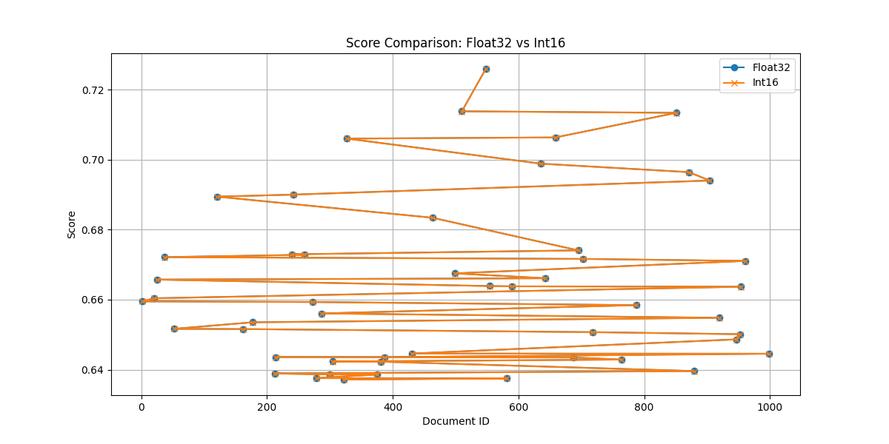
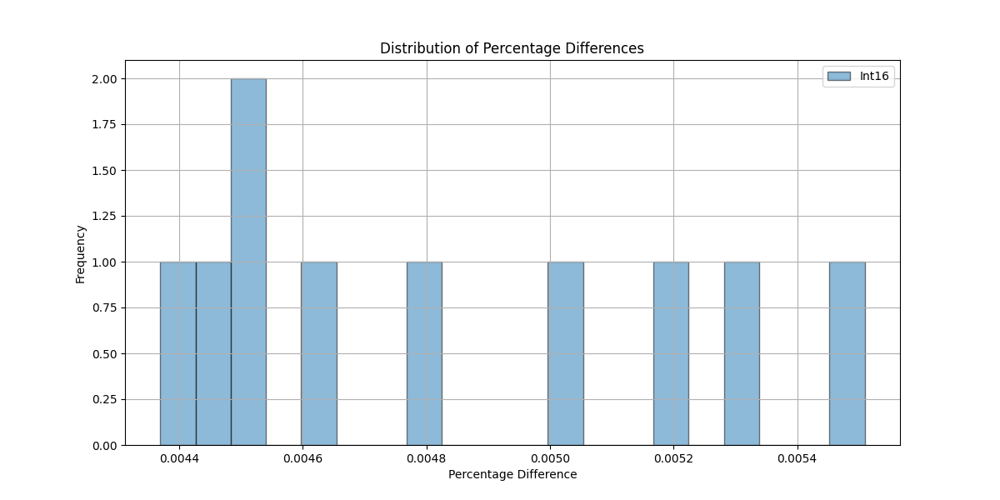
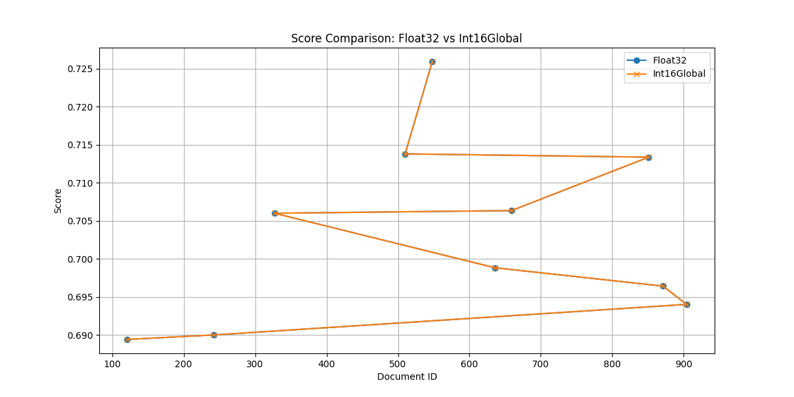
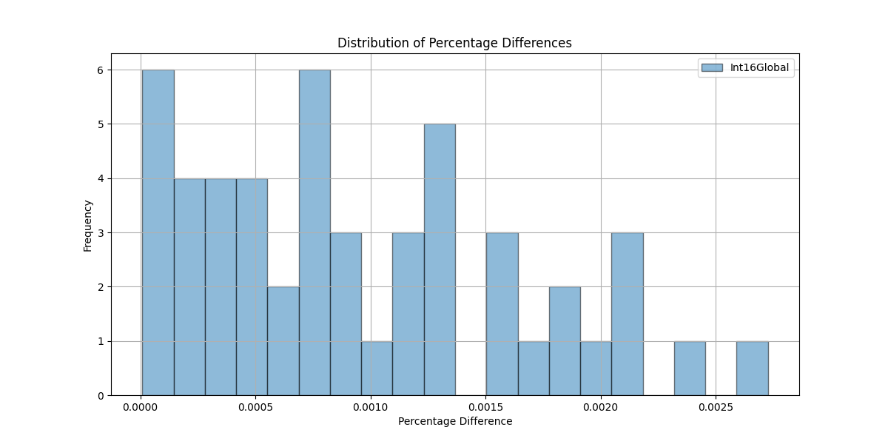

# Grok-Quantized-RAG-Navigator

A project comparing local and global quantization strategies for vector databases, focusing on performance, precision, efficiency, and disk storage.

## Importance

In the rapidly evolving landscape of artificial intelligence and machine learning, efficient management and retrieval of high-dimensional data have become paramount. Vector databases play a crucial role in enabling applications such as **Retrieval-Augmented Generation (RAG)**, **recommendation systems**, **semantic search engines**, and **personalized content delivery**. These applications rely on the ability to perform swift and accurate similarity searches across vast datasets of embedding vectors.

### Efficient Resource Utilization

As the volume of data scales, so does the dimensionality of embeddings, leading to significant **memory and storage demands**. Traditional **Float32** representations, while precise, are **memory-intensive** and **computationally expensive**, posing challenges for large-scale deployments. **Quantization** techniques, which reduce the bit-depth of embeddings (e.g., to **Int4**, **Int8**, or **Int16**), offer a solution by **compressing data** and **reducing memory footprint**, thereby enabling more **cost-effective** and **scalable** systems.

### Balancing Precision and Performance

Quantization inherently involves a trade-off between **precision** and **performance**. **Local quantization** ensures high precision by tailoring the scaling factor to each document's unique embedding distribution, making it ideal for applications where **accuracy is critical**. Conversely, **global quantization** applies a uniform scaling factor across all embeddings, simplifying the process and enhancing **computational efficiency**, which is beneficial for **real-time** and **large-scale** applications where **speed** is a priority.

### Enhancing Scalability and Speed

By implementing quantization strategies, vector databases can achieve **faster indexing and retrieval times**, essential for applications requiring **low-latency** responses. This improvement is particularly significant in scenarios involving **millions of documents**, where efficient similarity search directly impacts the **user experience** and **system responsiveness**.

### Practical Implications for Deployment

Understanding the **trade-offs** between local and global quantization methods empowers developers and organizations to make informed decisions based on their specific use cases. For instance, **global quantization** may be preferred in environments where **uniform data distributions** exist and **memory constraints** are stringent, while **local quantization** is better suited for **diverse datasets** requiring **high precision**.

### Driving Innovation in AI Applications

The ability to efficiently store and retrieve high-dimensional embeddings accelerates the development of **advanced AI models** and **intelligent systems**. By optimizing vector databases through quantization, researchers and engineers can push the boundaries of what is possible in areas like **natural language processing**, **computer vision**, and **personalized medicine**, fostering **innovation** and **enhanced capabilities** in AI-driven applications.

---

By systematically evaluating and implementing both local and global quantization strategies, the **Grok-Quantized-RAG-Navigator** project addresses critical challenges in managing high-dimensional data. This enables the creation of **robust**, **scalable**, and **efficient** vector databases that underpin the next generation of intelligent applications.

## Table of Contents

- [Overview](#overview)
- [Analysis Report: Int4, Int8, and Int16 Quantization Methods](#analysis-report-int4-int8-and-int16-quantization-methods)
  - [Summary](#summary)
  - [Observations](#observations)
    - [1. Int4 Quantization](#1-int4-quantization)
    - [2. Int8 Quantization](#2-int8-quantization)
    - [3. Int16 Quantization](#3-int16-quantization)
  - [Key Takeaways](#key-takeaways)
  - [Recommendations](#recommendations)
  - [Results Summary Table](#results-summary-table)
  - [Conclusion](#conclusion)
  - [Analysis of `VectorDBInt16Global.py` vs `VectorDBInt16.py`](#analysis-of-vectordbint16globalpy-vs-vectordbint16py)
  - [Analysis of `VectorDBInt8Global.py` vs `VectorDBInt8.py`](#analysis-of-vectordbint8globalpy-vs-vectordbint8py)
  - [Analysis of `VectorDBInt4Global.py` vs `VectorDBInt4.py`](#analysis-of-vectordbint4globalpy-vs-vectordbint4py)
- [Quantization in Vector Databases](#quantization-in-vector-databases)
- [Execution Context](#execution-context)
- [Visualizations](#visualizations)
  - [Local Quantization (`VectorDBInt16`)](#local-quantization-vectordbint16)
  - [Global Quantization (`VectorDBInt16Global`)](#global-quantization-vectordbint16global)
- [Setup & Running](#setup--running)
  - [Dependencies](#dependencies)
  - [Running the Analysis](#running-the-analysis)
- [Recommendations](#recommendations-1)

---

## Overview

This repository contains implementations and analyses of two quantization methods for vector databases:

- **Local Quantization** (`VectorDBInt16`): Quantizes each document's embeddings independently.
- **Global Quantization** (`VectorDBInt16Global`): Applies a single quantization limit to all embeddings.

---

# Analysis Report: Int4, Int8, and Int16 Quantization Methods

## Summary

This report evaluates the performance of various quantization methods (**Int4**, **Int8**, **Int16**) applied to a FAISS index with an embedding dimension of 1024. The analysis includes both local and global workflows, comparing the quantized methods against the baseline **Float32** results for the query: *"Artificial intelligence is transforming industries."*

---

## Observations

### 1. **Int4 Quantization**
- **Average Percentage Difference (Local):** 0.4411%
- **Median Percentage Difference (Local):** 0.3560%
- **Average Percentage Difference (Global):** 0.5474%
- **Median Percentage Difference (Global):** 0.5474%
- **Maximum Percentage Difference:** 2.1938% (Local), 0.6051% (Global)
- **Document ID Mismatches:** Several mismatches between Float32 and Int4 document IDs.
  
**Notes:** 
- Minor deviations in scores compared to Float32.
- Document mismatches indicate potential indexing alignment issues.
- Global Int4 demonstrated slightly better stability than Local Int4.

### 2. **Int8 Quantization**
- **Average Percentage Difference (Local):** 1.2454%
- **Median Percentage Difference (Local):** 1.2127%
- **Average Percentage Difference (Global):** 0.0483%
- **Median Percentage Difference (Global):** 0.0244%
- **Maximum Percentage Difference:** 1.4241% (Local), 0.1664% (Global)
- **Minimum Percentage Difference:** 1.1170% (Local), 0.0005% (Global)
  
**Notes:** 
- Global Int8 showed near-perfect alignment with Float32, with minimal differences.
- Local Int8 introduced slightly higher deviations but remained within acceptable thresholds for most applications.

### 3. **Int16 Quantization**
- **Average Percentage Difference (Local):** 0.0048%
- **Median Percentage Difference (Local):** 0.0047%
- **Average Percentage Difference (Global):** 0.0011%
- **Median Percentage Difference (Global):** 0.0011%
- **Maximum Percentage Difference:** 0.0055% (Local), 0.0021% (Global)
- **Minimum Percentage Difference:** 0.0044% (Local), 0.0002% (Global)
  
**Notes:** 
- Both Local and Global Int16 quantization exhibited exceptional accuracy, nearly mirroring the Float32 results.
- Deviations are negligible, making Int16 the most reliable quantization method in this analysis.

---

## Key Takeaways

1. **Accuracy Trends:**
   - **Int4:** Suitable for scenarios with tight memory constraints but involves minor trade-offs in accuracy and potential document mismatches.
   - **Int8:** Provides a good balance between memory savings and accuracy, especially with the global workflow.
   - **Int16:** Delivers near-lossless accuracy while still offering compression benefits.

2. **Document ID Mismatches:**
   - Discrepancies in document IDs suggest possible alignment or indexing issues in the quantized workflows. Further debugging is recommended to ensure consistency.

3. **Performance Stability:**
   - Global workflows consistently outperformed local workflows in terms of accuracy and score alignment with Float32.

---

## Recommendations

1. **Use Case Fit:**
   - **Int4:** Best for extreme memory-constrained environments where slight accuracy loss is acceptable.
   - **Int8:** Ideal for most applications requiring a balance of memory efficiency and high accuracy.
   - **Int16:** Optimal for scenarios prioritizing accuracy with moderate memory savings.

2. **Alignment Issues:**
   - Investigate document ID mismatches between Float32 and quantized results to improve consistency and reliability.

3. **Global Workflow Preference:**
   - Favor global workflows over local ones for better accuracy and reduced deviation percentages.

---

## Results Summary Table

| **Quantization Method** | **Workflow Type** | **Avg. Diff (%)** | **Median Diff (%)** | **Max Diff (%)** | **Min Diff (%)** |
|-------------------------|--------------------|--------------------|----------------------|-------------------|-------------------|
| **Int4**                | Local              | 0.4411             | 0.3560               | 2.1938            | 0.0849            |
|                         | Global             | 0.5474             | 0.5474               | 0.6051            | 0.4896            |
| **Int8**                | Local              | 1.2454             | 1.2127               | 1.4241            | 1.1170            |
|                         | Global             | 0.0483             | 0.0244               | 0.1664            | 0.0005            |
| **Int16**               | Local              | 0.0048             | 0.0047               | 0.0055            | 0.0044            |
|                         | Global             | 0.0011             | 0.0011               | 0.0021            | 0.0002            |

---

## Conclusion

- **Int16 Global Workflow:** Recommended for applications demanding the highest accuracy.
- **Int8 Global Workflow:** Offers an excellent balance of performance and efficiency.
- **Int4 Local Workflow:** Feasible for extreme memory-limited cases but requires improvement in document alignment.

Results are saved in `results.csv` for detailed inspection.

---

# Analysis of `VectorDBInt16Global.py` vs `VectorDBInt16.py`

## Core Differences

### Quantization Approach

- **`VectorDBInt16Global.py`** employs a **global quantization** strategy, clipping all embeddings to a single global limit (±1.0 by default). This approach utilizes a uniform scaling factor across all documents, simplifying data management but potentially sacrificing precision for documents with outliers.

- **`VectorDBInt16.py`** utilizes **local quantization**, scaling each document's embedding based on its own min and max values. This method preserves the distribution of each document's data, offering higher precision for individual documents but requiring additional metadata (min and max values) for each embedding.

### Storage and Overhead

- **Global Quantization:**
  - **Low Overhead:** Does **not** store per-document scaling data, minimizing storage requirements.
  - **Limitation:** May struggle with documents that have diverse value ranges.

- **Local Quantization:**
  - **High Overhead:** **Increases storage** due to the need to save min and max values for each document.
  - **Advantage:** Ensures better handling of document-specific variance, especially in large datasets.

### Performance and Precision

- **Global Quantization:**
  - **Consistent Performance:** Uniform quantization rules lead to predictable and stable performance across all documents.
  - **Precision Trade-off:** May compromise precision for documents with extreme values outside the global clipping range.

- **Local Quantization:**
  - **High Precision:** Maintains precision by preserving each document's embedding distribution, effectively handling outliers.
  - **Variable Performance:** Introduces higher computational overhead due to document-specific scaling and dequantization processes.

## Algorithm Descriptions

### Local Quantization (`VectorDBInt16`)

- **Method:** Each document's embedding is quantized independently, scaling based on its own min and max values. This retains the original distribution but requires storing `min_max` values for dequantization.

  **Pros:**
  - High precision for documents with unique value distributions.
  - Better handling of outliers within individual documents.

  **Cons:**
  - Higher storage requirements due to additional metadata.
  - Increased computational overhead for scaling and dequantization during searches.

### Global Quantization (`VectorDBInt16Global`)

- **Method:** Uses a single global clipping limit for all embeddings, applying uniform scaling across documents. This simplifies data management but might not handle outliers as effectively for all documents.

  **Pros:**
  - Lower storage overhead since no per-document scaling data is needed.
  - Simplified quantization process leads to consistent performance.

  **Cons:**
  - Potential loss of precision for documents with values outside the common range.

## Implementation Details

### Embedding Generation

Both classes generate embeddings via an external API, but their quantization strategies differ:
- **`VectorDBInt16Global`** applies a global clip and scale.
- **`VectorDBInt16`** applies document-specific scaling.

### Search Mechanism

Both implementations employ a two-phase search process:
1. **Phase 1:** An approximate search using binary embeddings for efficiency.
2. **Phase 2:** A refinement phase using either Float32 or quantized embeddings. The choice affects the balance between speed and accuracy:
   - **`VectorDBInt16Global`** uses a single scale for dequantization, which might not capture document-specific nuances.
   - **`VectorDBInt16`** dequantizes back to Float32 using document-specific scales, potentially offering more accurate results at the cost of additional computational steps.

### Database Management

Both utilize **FAISS** for indexing and **RocksDB** for document storage, ensuring disk-based operations for scalability. However, the local quantization in **`VectorDBInt16`** requires additional management of per-document metadata.

## Disk Databases

Both implementations leverage disk-based storage using:

- **FAISS:** For efficient similarity search on disk.
- **RocksDB** (via `Rdict`): For persistent document storage.

**Advantages of Disk Databases over In-Memory (Float32):**

1. **Memory Efficiency:** Quantized embeddings (Int16) significantly reduce memory usage compared to Float32.
2. **Disk Space Savings:** Int16 quantization halves the storage requirement per embedding vector.
3. **Faster Index Loading:** Enables quicker restarts and scaling across sessions.
4. **Scalability:** Handles datasets too large to fit in RAM.
5. **Precision vs. Performance:** Balances negligible precision loss with storage and speed efficiency.

## Use Cases

### Local Quantization (`VectorDBInt16`)

- **Specialized Content:** Ideal for content with varied embedding value ranges.
- **High Precision Requirement:** Critical for applications needing precise similarity scores, e.g., medical diagnostics or personalized recommendations.
- **Small to Medium Datasets:** Where storage isn't a concern, and precision is prioritized.

### Global Quantization (`VectorDBInt16Global`)

- **Generalized Content:** Best for datasets with uniform content, like general news or broad forums.
- **Large Scale Applications:** Ideal for millions of documents where memory efficiency is key.
- **Real-Time Systems:** Prioritizes speed and uniform performance.

## Conclusion

Choosing between `VectorDBInt16Global` and `VectorDBInt16` depends on the trade-off between precision, storage, and performance:

- **`VectorDBInt16Global`** is suited for scenarios where simplicity and scalability are key, making it ideal for large-scale, uniform datasets where memory and computational efficiency are prioritized over precision for individual documents.
  
- **`VectorDBInt16`** is ideal when individual document precision is critical, such as in specialized content areas (e.g., medical, technical documents). It ensures better handling of document-specific variance at the cost of increased storage and computational overhead.

---

# Comparison Table: `VectorDBInt16Global.py` vs `VectorDBInt16.py`

| **Feature**                     | **`VectorDBInt16Global.py`**                                                                 | **`VectorDBInt16.py`**                                                                                     |
|---------------------------------|----------------------------------------------------------------------------------------------|-------------------------------------------------------------------------------------------------------------|
| **Quantization Approach**       | **Global Quantization** All embeddings are clipped to a single global limit (±1.0 by default). Uses a uniform scaling factor across all documents. | **Local Quantization** Embeddings are scaled based on each document's own min and max values. Retains individual distributions. |
| **Storage and Overhead**        | **Low Overhead** Does **not** store per-document scaling data, minimizing storage requirements. | **High Overhead** Requires storing min and max values for each document, significantly increasing storage for large datasets. |
| **Performance**                 | **Consistent Performance** Uniform quantization ensures predictable and stable performance across all documents. | **Variable Performance** Higher computational overhead due to document-specific scaling and dequantization processes. |
| **Precision**                   | **Potential Precision Loss** May lose precision for documents with outliers outside the global clipping range. | **High Precision** Maintains precision by preserving each document's embedding distribution, effectively handling outliers. |
| **Pros**                        | - Lower storage requirements - Simplified data management - Consistent and efficient performance | - Higher precision for individual documents - Better handling of outliers - Preserves original embedding distributions |
| **Cons**                        | - May compromise precision for documents with extreme values - Less flexible in handling diverse data ranges | - Increased storage due to additional metadata - More computationally intensive during searches |
| **Embedding Generation**        | Applies a global clip and scale uniformly to all embeddings.                               | Applies document-specific scaling based on each document's min and max values.                              |
| **Search Mechanism**            | - **Phase 1:** Approximate search using binary embeddings - **Phase 2:** Refinement using a single global scale for dequantization | - **Phase 1:** Approximate search using binary embeddings - **Phase 2:** Refinement using document-specific scales for dequantization |
| **Database Management**         | Utilizes **FAISS** for indexing and **RocksDB** for document storage without additional metadata management. | Utilizes **FAISS** for indexing and **RocksDB** for document storage, with added complexity for managing per-document metadata. |
| **Use Case Suitability**        | - Large-scale, uniform datasets - Real-time systems - Generalized content like news or forums | - Specialized content areas (e.g., medical, technical documents) - Applications requiring high precision in similarity searches - Small to medium datasets where storage is less of a concern |
| **Advantages of Disk Databases**| - Memory efficiency with Int16 - Disk space savings - Faster index loading - Scalability - Balanced precision and performance | - Memory efficiency with Int16 - Disk space savings - Faster index loading - Scalability - Balanced precision and performance |
| **Implementation Complexity**   | **Lower Complexity** Uniform scaling simplifies implementation and maintenance. | **Higher Complexity** Managing per-document scaling factors adds to implementation and maintenance efforts. |

---

**Conclusion:**  
Choose **`VectorDBInt16Global.py`** for scenarios prioritizing simplicity, scalability, and memory efficiency in large-scale or uniform datasets. Opt for **`VectorDBInt16.py`** when individual document precision is critical, such as in specialized content domains, despite the increased storage and computational overhead.

---

---

# Analysis of `VectorDBInt8Global.py` vs `VectorDBInt8.py`

## Core Differences

### Quantization Approach

- **`VectorDBInt8Global.py`** employs a **global quantization** strategy, clipping all embeddings to a single global limit (±0.3 by default). This approach utilizes a uniform scaling factor across all documents, simplifying data management but potentially sacrificing precision for documents with outliers.

- **`VectorDBInt8.py`** utilizes **local quantization**, scaling each document's embedding based on its own min and max values. This method preserves the distribution of each document's data, offering higher precision for individual documents but requiring additional metadata (min and max values) for each embedding.

### Storage and Overhead

- **Global Quantization:**
  - **Low Overhead:** Does **not** store per-document scaling data, minimizing storage requirements.
  - **Limitation:** May struggle with documents that have diverse value ranges.

- **Local Quantization:**
  - **High Overhead:** **Increases storage** due to the need to save min and max values for each document.
  - **Advantage:** Ensures better handling of document-specific variance, especially in large datasets.

### Performance and Precision

- **Global Quantization:**
  - **Consistent Performance:** Uniform quantization rules lead to predictable and stable performance across all documents.
  - **Precision Trade-off:** May compromise precision for documents with extreme values outside the global clipping range.

- **Local Quantization:**
  - **High Precision:** Maintains precision by preserving each document's embedding distribution, effectively handling outliers.
  - **Variable Performance:** Introduces higher computational overhead due to document-specific scaling and dequantization processes.

---

## Algorithm Descriptions

### Local Quantization (`VectorDBInt8`)

- **Method:** Each document's embedding is quantized independently, scaling based on its own min and max values. This retains the original distribution but requires storing `min_max` values for dequantization.
  
  **Pros:**
  - High precision for documents with unique value distributions.
  - Better handling of outliers within individual documents.

  **Cons:**
  - Higher storage requirements due to additional metadata.
  - Increased computational overhead for scaling and dequantization during searches.

### Global Quantization (`VectorDBInt8Global`)

- **Method:** Uses a single global clipping limit for all embeddings, applying uniform scaling across documents. This simplifies data management but might not handle outliers as effectively for all documents.
  
  **Pros:**
  - Lower storage overhead since no per-document scaling data is needed.
  - Simplified quantization process leads to consistent performance.

  **Cons:**
  - Potential loss of precision for documents with values outside the common range.

---

## Implementation Details

### Embedding Generation

Both classes generate embeddings via an external API, but their quantization strategies differ:
- **`VectorDBInt8Global`** applies a global clip and scale.
- **`VectorDBInt8`** applies document-specific scaling based on each document's min and max values.

### Search Mechanism

Both implementations employ a two-phase search process:
1. **Phase 1:** An approximate search using binary embeddings for efficiency.
2. **Phase 2:** A refinement phase using either Float32 or quantized embeddings. The choice affects the balance between speed and accuracy:
   - **`VectorDBInt8Global`** uses a single scale for dequantization, which might not capture document-specific nuances.
   - **`VectorDBInt8`** dequantizes back to Float32 using document-specific scales, potentially offering more accurate results at the cost of additional computational steps.

### Database Management

Both utilize **FAISS** for indexing and **RocksDB** for document storage, ensuring disk-based operations for scalability. However, the local quantization in **`VectorDBInt8`** requires additional management of per-document metadata.

---

---

# Analysis of `VectorDBInt4Global.py` vs `VectorDBInt4.py`

## Core Differences

### Quantization Approach

- **`VectorDBInt4Global.py`** employs a **global quantization** strategy, clipping all embeddings to a single global limit (±0.18 by default). This approach utilizes a uniform scaling factor across all documents, simplifying data management but potentially sacrificing precision for documents with outliers.

- **`VectorDBInt4.py`** utilizes **local quantization**, scaling each document's embedding based on its own min and max values. This method preserves the distribution of each document's data, offering higher precision for individual documents but requiring additional metadata (min and max values) for each embedding.

### Storage and Overhead

- **Global Quantization:**
  - **Low Overhead:** Does **not** store per-document scaling data, minimizing storage requirements.
  - **Limitation:** May struggle with documents that have diverse value ranges.

- **Local Quantization:**
  - **High Overhead:** **Increases storage** due to the need to save min and max values for each document.
  - **Advantage:** Ensures better handling of document-specific variance, especially in large datasets.

### Performance and Precision

- **Global Quantization:**
  - **Consistent Performance:** Uniform quantization rules lead to predictable and stable performance across all documents.
  - **Precision Trade-off:** May compromise precision for documents with extreme values outside the global clipping range.

- **Local Quantization:**
  - **High Precision:** Maintains precision by preserving each document's embedding distribution, effectively handling outliers.
  - **Variable Performance:** Introduces higher computational overhead due to document-specific scaling and dequantization processes.

---

## Algorithm Descriptions

### Local Quantization (`VectorDBInt4`)

- **Method:** Each document's embedding is quantized independently, scaling based on its own min and max values. This retains the original distribution but requires storing `min_max` values for dequantization.
  
  **Pros:**
  - High precision for documents with unique value distributions.
  - Better handling of outliers within individual documents.

  **Cons:**
  - Higher storage requirements due to additional metadata.
  - Increased computational overhead for scaling and dequantization during searches.

### Global Quantization (`VectorDBInt4Global`)

- **Method:** Uses a single global clipping limit for all embeddings, applying uniform scaling across documents. This simplifies data management but might not handle outliers as effectively for all documents.
  
  **Pros:**
  - Lower storage overhead since no per-document scaling data is needed.
  - Simplified quantization process leads to consistent performance.

  **Cons:**
  - Potential loss of precision for documents with values outside the common range.

---

## Implementation Details

### Embedding Generation

Both classes generate embeddings via an external API, but their quantization strategies differ:
- **`VectorDBInt4Global`** applies a global clip and scale.
- **`VectorDBInt4`** applies document-specific scaling based on each document's min and max values.

### Search Mechanism

Both implementations employ a two-phase search process:
1. **Phase 1:** An approximate search using binary embeddings for efficiency.
2. **Phase 2:** A refinement phase using either Float32 or quantized embeddings. The choice affects the balance between speed and accuracy:
   - **`VectorDBInt4Global`** uses a single scale for dequantization, which might not capture document-specific nuances.
   - **`VectorDBInt4`** dequantizes back to Float32 using document-specific scales, potentially offering more accurate results at the cost of additional computational steps.

### Database Management

Both utilize **FAISS** for indexing and **RocksDB** for document storage, ensuring disk-based operations for scalability. However, the local quantization in **`VectorDBInt4`** requires additional management of per-document metadata.

---

## Disk Databases

Both implementations leverage disk-based storage using:

- **FAISS:** For efficient similarity search on disk.
- **RocksDB** (via `Rdict`): For persistent document storage.

**Advantages of Disk Databases over In-Memory (Float32):**

1. **Memory Efficiency:** Quantized embeddings (Int4) significantly reduce memory usage compared to Float32.
2. **Disk Space Savings:** Int4 quantization reduces the storage requirement per embedding vector by 75%.
3. **Faster Index Loading:** Enables quicker restarts and scaling across sessions.
4. **Scalability:** Handles datasets too large to fit in RAM.
5. **Precision vs. Performance:** Balances manageable precision loss with storage and speed efficiency.

---

## Use Cases

### Local Quantization (`VectorDBInt4`)

- **Specialized Content:** Ideal for content with varied embedding value ranges.
- **High Precision Requirement:** Critical for applications needing precise similarity scores, e.g., medical diagnostics or personalized recommendations.
- **Small to Medium Datasets:** Where storage isn't a concern, and precision is prioritized.

### Global Quantization (`VectorDBInt4Global`)

- **Generalized Content:** Best for datasets with uniform content, like general news or broad forums.
- **Large Scale Applications:** Ideal for millions of documents where memory efficiency is key.
- **Real-Time Systems:** Prioritizes speed and uniform performance.

---

# Comparison Table: `VectorDBInt4Global.py` vs `VectorDBInt4.py`, `VectorDBInt8Global.py` vs `VectorDBInt8.py`, and `VectorDBInt16Global.py` vs `VectorDBInt16.py`

| **Feature**                     | **`VectorDBInt4Global.py`**                                                                 | **`VectorDBInt4.py`**                                                                                     | **`VectorDBInt8Global.py`**                                                               | **`VectorDBInt8.py`**                                                                                     | **`VectorDBInt16Global.py`**                                                               | **`VectorDBInt16.py`**                                                                                     |
|---------------------------------|----------------------------------------------------------------------------------------------|-------------------------------------------------------------------------------------------------------------|-------------------------------------------------------------------------------------------|-------------------------------------------------------------------------------------------------------------|-------------------------------------------------------------------------------------------|-------------------------------------------------------------------------------------------------------------|
| **Quantization Approach**       | **Global Quantization** All embeddings are clipped to a single global limit (±0.18 by default). Uses a uniform scaling factor across all documents. | **Local Quantization** Embeddings are scaled based on each document's own min and max values. Retains individual distributions. | **Global Quantization** All embeddings are clipped to a single global limit (±0.3 by default). Uses a uniform scaling factor across all documents. | **Local Quantization** Embeddings are scaled based on each document's own min and max values. Retains individual distributions. | **Global Quantization** All embeddings are clipped to a single global limit (±1.0 by default). Uses a uniform scaling factor across all documents. | **Local Quantization** Embeddings are scaled based on each document's own min and max values. Retains individual distributions. |
| **Storage and Overhead**        | **Low Overhead** Does **not** store per-document scaling data, minimizing storage requirements. | **High Overhead** Requires storing min and max values for each document, significantly increasing storage for large datasets. | **Low Overhead** Does **not** store per-document scaling data, minimizing storage requirements. | **High Overhead** Requires storing min and max values for each document, significantly increasing storage for large datasets. | **Low Overhead** Does **not** store per-document scaling data, minimizing storage requirements. | **High Overhead** Requires storing min and max values for each document, significantly increasing storage for large datasets. |
| **Performance**                 | **Consistent Performance** Uniform quantization ensures predictable and stable performance across all documents. | **Variable Performance** Higher computational overhead due to document-specific scaling and dequantization processes. | **Consistent Performance** Uniform quantization ensures predictable and stable performance across all documents. | **Variable Performance** Higher computational overhead due to document-specific scaling and dequantization processes. | **Consistent Performance** Uniform quantization ensures predictable and stable performance across all documents. | **Variable Performance** Higher computational overhead due to document-specific scaling and dequantization processes. |
| **Precision**                   | **Potential Precision Loss** May lose precision for documents with outliers outside the global clipping range. | **High Precision** Maintains precision by preserving each document's embedding distribution, effectively handling outliers. | **Potential Precision Loss** May lose precision for documents with outliers outside the global clipping range. | **High Precision** Maintains precision by preserving each document's embedding distribution, effectively handling outliers. | **Potential Precision Loss** May lose precision for documents with outliers outside the global clipping range. | **High Precision** Maintains precision by preserving each document's embedding distribution, effectively handling outliers. |
| **Pros**                        | - Lower storage requirements - Simplified data management - Consistent and efficient performance | - Higher precision for individual documents - Better handling of outliers - Preserves original embedding distributions | - Lower storage requirements - Simplified data management - Consistent and efficient performance | - Higher precision for individual documents - Better handling of outliers - Preserves original embedding distributions | - Lower storage requirements - Simplified data management - Consistent and efficient performance | - Higher precision for individual documents - Better handling of outliers - Preserves original embedding distributions |
| **Cons**                        | - May compromise precision for documents with extreme values - Less flexible in handling diverse data ranges | - Increased storage due to additional metadata - More computationally intensive during searches | - May compromise precision for documents with extreme values - Less flexible in handling diverse data ranges | - Increased storage due to additional metadata - More computationally intensive during searches | - May compromise precision for documents with extreme values - Less flexible in handling diverse data ranges | - Increased storage due to additional metadata - More computationally intensive during searches |
| **Embedding Generation**        | Applies a global clip and scale uniformly to all embeddings.                               | Applies document-specific scaling based on each document's min and max values.                              | Applies a global clip and scale uniformly to all embeddings.                               | Applies document-specific scaling based on each document's min and max values.                              | Applies a global clip and scale uniformly to all embeddings.                               | Applies document-specific scaling based on each document's min and max values.                              |
| **Search Mechanism**            | - **Phase 1:** Approximate search using binary embeddings - **Phase 2:** Refinement using a single global scale for dequantization | - **Phase 1:** Approximate search using binary embeddings - **Phase 2:** Refinement using document-specific scales for dequantization | - **Phase 1:** Approximate search using binary embeddings - **Phase 2:** Refinement using a single global scale for dequantization | - **Phase 1:** Approximate search using binary embeddings - **Phase 2:** Refinement using document-specific scales for dequantization | - **Phase 1:** Approximate search using binary embeddings - **Phase 2:** Refinement using a single global scale for dequantization | - **Phase 1:** Approximate search using binary embeddings - **Phase 2:** Refinement using document-specific scales for dequantization |
| **Database Management**         | Utilizes **FAISS** for indexing and **RocksDB** for document storage without additional metadata management. | Utilizes **FAISS** for indexing and **RocksDB** for document storage, with added complexity for managing per-document metadata. | Utilizes **FAISS** for indexing and **RocksDB** for document storage without additional metadata management. | Utilizes **FAISS** for indexing and **RocksDB** for document storage, with added complexity for managing per-document metadata. | Utilizes **FAISS** for indexing and **RocksDB** for document storage without additional metadata management. | Utilizes **FAISS** for indexing and **RocksDB** for document storage, with added complexity for managing per-document metadata. |
| **Use Case Suitability**        | - Large-scale, uniform datasets - Real-time systems - Generalized content like news or forums | - Specialized content areas (e.g., medical, technical documents) - Applications requiring high precision in similarity searches - Small to medium datasets where storage is less of a concern | - Large-scale, uniform datasets - Real-time systems - Generalized content like news or forums | - Specialized content areas (e.g., medical, technical documents) - Applications requiring high precision in similarity searches - Small to medium datasets where storage is less of a concern | - Large-scale, uniform datasets - Real-time systems - Generalized content like news or forums | - Specialized content areas (e.g., medical, technical documents) - Applications requiring high precision in similarity searches - Small to medium datasets where storage is less of a concern |
| **Advantages of Disk Databases**| - Memory efficiency with Int4 - Disk space savings - Faster index loading - Scalability - Balanced precision and performance | - Memory efficiency with Int4 - Disk space savings - Faster index loading - Scalability - Balanced precision and performance | - Memory efficiency with Int8 - Disk space savings - Faster index loading - Scalability - Balanced precision and performance | - Memory efficiency with Int8 - Disk space savings - Faster index loading - Scalability - Balanced precision and performance | - Memory efficiency with Int16 - Disk space savings - Faster index loading - Scalability - Balanced precision and performance | - Memory efficiency with Int16 - Disk space savings - Faster index loading - Scalability - Balanced precision and performance |
| **Implementation Complexity**   | **Lower Complexity** Uniform scaling simplifies implementation and maintenance. | **Higher Complexity** Managing per-document scaling factors adds to implementation and maintenance efforts. | **Lower Complexity** Uniform scaling simplifies implementation and maintenance. | **Higher Complexity** Managing per-document scaling factors adds to implementation and maintenance efforts. | **Lower Complexity** Uniform scaling simplifies implementation and maintenance. | **Higher Complexity** Managing per-document scaling factors adds to implementation and maintenance efforts. |

---

**Conclusion:**  
Choose **`VectorDBInt4Global.py`**, **`VectorDBInt8Global.py`**, or **`VectorDBInt16Global.py`** for scenarios prioritizing simplicity, scalability, and memory efficiency in large-scale or uniform datasets. Opt for **`VectorDBInt4.py`**, **`VectorDBInt8.py`**, or **`VectorDBInt16.py`** when individual document precision is critical, such as in specialized content domains, despite the increased storage and computational overhead.

---
## Quantization in Vector Databases

This repository includes scripts for managing vector databases with different quantization bit depths:

- **`VectorDBInt4.py`**: Handles local 4-bit integer quantization.
- **`VectorDBInt4Global.py`**: Applies global 4-bit integer quantization.
- **`VectorDBInt8.py`**: Manages local 8-bit integer quantization.
- **`VectorDBInt8Global.py`**: Uses global 8-bit integer quantization.
- **`VectorDBInt16.py`**: Implements local 16-bit integer quantization.
- **`VectorDBInt16Global.py`**: Performs global 16-bit integer quantization.

---

## Execution Context

- **Environment:** macOS (Mac-mini)
- **User:** Constantine
- **Execution Date:** January 16, 2025

---

## Recommendations

1. **Prefer Global Quantization:**
   - For consistency across datasets.

2. **Bit Depth Selection:**
   - **Int4:** Use for extreme space constraints.
   - **Int8:** Opt for a balance between space and accuracy.
   - **Int16:** Choose when maintaining high precision is crucial.

3. **Error Management:**
   - Address document ID mismatches in local quantization scenarios to enhance consistency and reliability.

4. **Performance Testing:**
   - Regularly benchmark to understand and manage trade-offs between different quantization methods.

---

By following these guidelines and leveraging the provided scripts, you can effectively manage and optimize vector databases tailored to your specific application needs and constraints.

## Visualizations

### Local Quantization (`VectorDBInt16`)

**Score Comparison:**

**Percentage Differences:**

### Global Quantization (`VectorDBInt16Global`)

**Score Comparison:**

**Percentage Differences:**

---

## Setup & Running

### Dependencies

Ensure Python is installed with libraries like `numpy`, `pandas`, `faiss`, `requests`, etc.

### Running the Analysis

Run the main script using the following command:

